# SolidWorks Study Notes

> Current learning progress: 43 / 43
>
> These notes are updated according to actual learning progress. Each lesson contains only: Core Summary, Common Mistakes, and Operation Notes.

<!-- video-course-notes-progress: P43/43 -->

# Phase 1: Interface and Sketching Fundamentals (P01–P08)

## P01 Lesson 1: Course Introduction, Software Interface, and Basic Operations

### Core Summary

- SOLIDWORKS primarily uses three document types: parts, assemblies, and drawings. Each document type displays its own tools and FeatureManager design tree content.
- The basic part-modeling workflow is: select a plane → create a sketch → apply dimensional constraints → create a feature.
- The FeatureManager design tree records every modeling step. Rotating the view or using Normal To changes only the viewing direction, not the model itself.

### Common Mistakes

- Failing to save immediately after creating a part, or neglecting to save periodically while modeling;
- Starting a sketch without first selecting a reference plane;
- Assuming a blue rectangle is already fully defined;
- Mistaking view rotation for a change to the model's actual orientation;
- Failing to expand an extrude feature and therefore being unable to find its sketch.

### Operation Notes

- Ctrl+N creates a new document; Ctrl+S saves the current document.
- Sketch > Sketch > Front Plane creates a sketch on the Front Plane.
- Sketch > Center Rectangle, draw from the origin and dimension both sides to 100 mm to create a fully defined square.
- Features > Extruded Boss/Base > Depth 100 mm creates a 100 mm cube.
- Hold and drag the middle mouse button to rotate the model freely.
- View Orientation > Normal To aligns the view perpendicular to the selected plane.

---

## P02 Study Guide and Learning Roadmap

### Core Summary

- Keep SOLIDWORKS open while watching the lessons and perform each operation yourself instead of only watching.
- The learning sequence is divided into sketching, parts, assemblies, and drawings, with exercises accompanying every stage.
- After learning the basic functions, continue with complete projects. True mastery means being able to complete a design independently.

### Common Mistakes

- Watching videos or copying steps without practicing simultaneously in the software;
- Watching lessons continuously while skipping the stage exercises in the learning roadmap;
- Giving up when an exercise becomes difficult instead of reviewing the relevant lesson and solution;
- Treating “understood it” as “mastered it” without rebuilding the model from memory.

### Operation Notes

- This lesson introduces no new software operations.

---

## P03 Lesson 2: Sketching

### Core Summary

- Common sketch tools include Line, Rectangle, Circle, Arc, Slot, Sketch Fillet, Sketch Chamfer, and Point. Their drawing methods can be inferred from the icons and on-screen prompts.
- A sketch is usually drawn approximately first, then its position and size are defined with geometric relations and Smart Dimensions.
- Blue sketch entities still have degrees of freedom; black entities are fully defined. Conflicting geometric relations cause errors.
- Circle centers, line endpoints, and rectangle corners are all points. Standalone points can also locate pattern centers and other geometry.

### Common Mistakes

- Applying conflicting relations, such as Horizontal and Vertical, to the same line;
- Clicking the exit command after drawing and unintentionally discarding the current sketch edit;
- Dimensioning only the contour size without locating the contour relative to the origin;
- Confusing a slot's centerline length with its width;
- Ignoring the horizontal, vertical, and tangent indicators beside the pointer and creating incorrect relations.

### Operation Notes

- Ctrl+Z undoes the previous operation.
- Sketch confirmation corner > green check mark saves the sketch and exits sketch editing.
- FeatureManager design tree > Sketch > right-click > Edit Sketch reopens an existing sketch.
- Hold the right mouse button and gesture upward to start Smart Dimension quickly.
- Ctrl+middle-mouse drag pans the sketch view.
- Sketch > Sketch Fillet, select a corner and enter a radius to replace the two edges with a tangent arc.

---

## P04 Lesson 3: Sketch Relations and Editing

### Core Summary

- After selecting multiple sketch entities, you can add relations such as Perpendicular, Parallel, Equal, Collinear, Tangent, and Symmetric.
- Power Trim removes extra segments continuously as you drag across them; holding Shift while dragging can extend entities.
- Convert Entities projects existing model edges or sketches into the active sketch.
- Offset Entities creates an offset contour from model edges or sketch entities with a specified distance, direction, or bidirectional offset.

### Common Mistakes

- Failing to hold Ctrl and select every required entity, causing a relation to be unavailable or applied to the wrong entities;
- Adding duplicate dimensions and geometric relations, which overdefines the sketch;
- Dragging Power Trim across a segment that should remain;
- Ignoring the association between converted entities and their source edges or sketches;
- Failing to confirm that sketch editing is still active, causing later commands to affect the wrong objects.

### Operation Notes

- Hold Ctrl and select multiple sketch entities to apply a common geometric relation.
- Sketch > Trim Entities > Power Trim, hold the left mouse button and drag across segments to trim continuously.
- While Power Trim is active, hold Shift and drag an entity to extend it.
- Sketch > Convert Entities projects existing edges or sketches into the current sketch.
- Sketch > Offset Entities sets the offset distance, direction, or bidirectional offset.
- Smart Dimension, select two lines in sequence to dimension the angle between them.

---

## P05 Supplementary Lesson 1: Invalid Default Templates and Convert Entities

### Core Summary

- An “invalid default template” message usually means that the part or assembly template path in System Options does not point to an existing template file.
- Document Properties control drafting standards, dimension fonts, and similar settings. To apply changes to new documents, save the document as a template and assign it as the default template.
- Convert Entities extracts contours from model faces, edges, or existing sketches, reducing repeated drawing and inconsistent dimensions.

### Common Mistakes

- Dismissing the invalid-default-template message without repairing the template path;
- Closing the file after changing the dimension font without saving it as a template;
- Confusing part templates (`*.prtdot`) with assembly templates (`*.asmdot`);
- Replacing only the part template and forgetting to configure the assembly template separately;
- Running Convert Entities before entering the target sketch or selecting the wrong face.

### Operation Notes

- System Options > Default Templates, reselect valid part and assembly templates to resolve an invalid-default-template error.
- Document Properties > Dimensions > Font > Height 5.5 mm enlarges dimension text.
- File > Save As > Part Template (`*.prtdot`) saves the modified part template.
- File > Save As > Assembly Template (`*.asmdot`) saves the modified assembly template.
- Sketch > Convert Entities > select a model face to extract its boundary contour. Enter the sketch first, then select the face.

---

## P06 Supplementary Lesson 2: Sketching Workflow

### Core Summary

- Draw the complete contour first and check automatically created relations, then use Smart Dimensions to fully define the sketch step by step.
- Entering a line length directly in the PropertyManager does not replace a Smart Dimension. Driving dimensions and geometric relations are what actually control the sketch.
- A fully defined sketch requires both shape and size constraints, plus overall location through the origin, reference geometry, or locating dimensions.
- When a sketch remains blue, drag its entities to observe the remaining degrees of freedom and identify missing constraints from the movement direction.

### Common Mistakes

- Assuming that a line is constrained after entering its length in the Line PropertyManager;
- Dimensioning every size but failing to locate the sketch relative to the origin;
- Converting a driven dimension back to driving and creating duplicate dimensions or an overdefined sketch;
- Accepting unrelated automatic relations such as Vertical or Tangent;
- Deleting many correct relations after an error instead of first dragging the sketch to inspect its degrees of freedom.

### Operation Notes

- Smart Dimension > select a line to create a driving length dimension.
- Status bar > Units > MMGS changes the current part's length unit to millimeters.
- Dimension PropertyManager > Other > Driven switches between driving and driven dimensions.
- Hold Ctrl, select a sketch entity and the origin, then add Coincident to locate the sketch at the origin.
- Drag a blue sketch entity to determine which direction still lacks a constraint.

---

## P07 Lesson 4: Sketch Mirroring, Patterns, and Advanced Drawing Practice

### Core Summary

- Mirror Entities requires separate selections for the entities to mirror and the mirror axis; the mirror axis must be a line.
- Linear Sketch Pattern can define the instance count, spacing, and angle in two directions. The instance count includes the original entity.
- Circular Sketch Pattern requires a center point, patterned entities, instance count, and angle, and also supports equal spacing and skipped instances.
- Break complex sketches into local sections and complete each section through the cycle: draw → add relations → add dimensions → fully define.

### Common Mistakes

- Failing to activate the Mirror About selection box and accidentally adding the axis to Entities to Mirror;
- Assuming the pattern count excludes the original entity and creating one extra instance;
- Selecting the wrong center for a circular pattern;
- Drawing an entire complex sketch at once, making underdefined or conflicting areas difficult to locate;
- Confusing horizontal distance, vertical distance, and a line's true length.

### Operation Notes

- Sketch > Mirror Entities, select Entities to Mirror first, then activate Mirror About and select a line.
- Linear Sketch Pattern > Number of Instances includes the original entity.
- Linear Sketch Pattern > Direction 1/Direction 2 separately controls count, spacing, and direction angle.
- Circular Sketch Pattern > Pattern Center accepts a circle center or a standalone sketch point.
- Circular Sketch Pattern > Instances to Skip removes selected pattern positions.

---

## P08 Exercise Overview

### Core Summary

- Reinforce lessons promptly with sketch, part, assembly, and drawing exercises; otherwise the operations will be forgotten quickly.
- Match exercises to the learning stage: complete exercises for one function group immediately before moving to the next stage.
- Assembly exercises teach how to combine existing parts, while complete projects teach how to design parts from scratch and assemble them. Neither replaces the other.

### Common Mistakes

- Waiting too long after a lesson to practice and discovering later that the operations have been forgotten;
- Skipping supplementary lessons or changing the course order and attempting exercises beyond the current stage;
- Looking at the solution immediately after encountering difficulty instead of first trying independently;
- Completing only assembly exercises with ready-made parts and never completing a design-from-scratch project;
- Postponing every exercise until the entire course has been watched.

### Operation Notes

- This lesson introduces no new software operations.

---

# Phase 2: Part Features and Model Modification (P09–P20)

## P09 Supplementary Lesson 3: Feature Preview

### Core Summary

- Extruded Boss/Base fundamentally defines where the extrusion starts and where it ends, then turns a 2D contour into a solid along a specified direction.
- The extrusion can start on the sketch plane or at an offset from the sketch plane.
- End conditions include Blind, two directions, Mid Plane, Up to Surface, and Offset from Surface.
- Controlling an end condition with a model face expresses the geometric relationship more robustly than manually calculating a fixed depth.

### Common Mistakes

- Confusing the start condition with the end condition and changing the distance in the wrong option;
- Changing an offset value without checking Reverse Direction, causing the solid to appear on the wrong side of the sketch;
- Entering separate values for Direction 1 and Direction 2 when an equal two-sided extrusion should use Mid Plane;
- Forcing alignment to an existing face with a fixed depth, causing the model to lose alignment after later changes;
- Using Offset from Surface without confirming the offset direction.

### Operation Notes

- Extruded Boss/Base > Direction 1 > Reverse Direction switches the extrusion direction.
- Extruded Boss/Base > Direction 2 (selected) extrudes separately in both directions from the sketch.
- Extruded Boss/Base > End Condition > Mid Plane extrudes equal distances on both sides of the sketch.
- Extruded Boss/Base > Start Condition > Offset begins the extrusion at a specified distance from the sketch plane.
- Extruded Boss/Base > End Condition > Up to Surface ends the extrusion at the selected model face.

---

## P10 Lesson 5: Feature Creation and the FeatureManager Design Tree

### Core Summary

- Boss features add material and cut features remove material. Extrude, Revolve, Sweep, and Loft create geometry in different ways.
- Extruded Boss/Base requires a start condition, direction, and end condition; existing vertices, faces, or bodies can control the endpoint.
- Thin Feature extrudes the edges of a closed contour into walls with thickness and can control thickness direction, mid-plane thickness, or two-direction thickness.
- The FeatureManager design tree records modeling order. Editing an upstream sketch or feature updates downstream features that reference it.

### Common Mistakes

- Creating a practice file without saving it first;
- Setting an offset start or termination face without checking Reverse Direction;
- Confusing Up to Surface, Up to Body, and Offset from Surface;
- Reversing Thin Feature thickness so the model grows outside the intended contour;
- Editing an upstream sketch without considering references used by downstream features.

### Operation Notes

- Extruded Boss/Base > Start Condition > Offset changes the extrusion's start position.
- Extruded Boss/Base > End Condition can use Next, Up to Vertex, Up to Surface, Up to Body, or Mid Plane.
- Extruded Boss/Base > Thin Feature controls wall thickness, direction, Mid Plane, or two-direction thickness.
- Press F to fit the model to the graphics area.
- FeatureManager design tree > feature > Edit Feature reopens the feature parameters.
- FeatureManager design tree > expand feature > sketch > Edit Sketch modifies the source sketch used by the feature.

---

## P11 Lesson 6: Feature Creation, Part 2

### Core Summary

- Cut-Extrude supports end conditions such as Blind, Through All, and Up to Surface. Both model faces and reference planes can serve as termination surfaces.
- Reference planes define new modeling locations and can also control extrusion or cut endpoints.
- A sweep consists of a profile and a path, which must intersect. A helix combined with a circular profile can quickly create a spring.
- A revolved feature requires a cross-section and an axis of revolution. A regular line can serve as the axis, but construction geometry is easier for SOLIDWORKS to recognize automatically.

### Common Mistakes

- Selecting the wrong direction, model face, or reference plane for Up to Surface and getting an incorrect cut result;
- Creating a reference plane while it is hidden and assuming it was not created;
- Using a sweep path that does not intersect the profile, causing the sweep to fail;
- Looking for Helix and Spiral as a sketch command instead of under Features > Curves;
- Drawing the revolution axis as a regular line and then forgetting to select it manually in the Revolve feature.

### Operation Notes

- File > Save As preserves the previous lesson's model while allowing further practice on a copy.
- Cut-Extrude > End Condition > Up to Surface accepts a model face or reference plane as the cut endpoint.
- Features > Reference Geometry > Plane, select the Front Plane and set a 5 mm offset to create a reference plane.
- Heads-Up View toolbar > Hide/Show Items toggles all reference planes on or off.
- Features > Curves > Helix and Spiral, set Pitch to 5 mm and Revolutions to 10 to create a spring path.
- Insert > Annotations > Cosmetic Thread, select a circular edge with a 10 mm diameter to create an M10 cosmetic thread.

---

## P12 Supplementary Lesson 4: Sketch Planes, Regular Lines, and Construction Geometry

### Core Summary

- A regular 2D sketch can be created only on a reference plane or planar model face, not directly on a cylindrical or other curved face.
- When a feature is needed on a curved location, first create a suitable reference plane. A geometric Tangent relation is more robust than a fixed distance.
- Regular sketch lines participate in feature creation; construction geometry is used only for positioning, constraints, or an axis of revolution and does not form closed contours.

### Common Mistakes

- Attempting to start a regular 2D sketch directly on a cylindrical face;
- Starting a keyway cut at the cylinder center and forgetting to adjust the cut's start position;
- Defining only Tangent and failing to use the Front Plane to control the new plane's orientation;
- Converting an outer contour edge to construction geometry by mistake;
- Deleting the closing regular line that SOLIDWORKS added automatically while editing a revolve sketch.

### Operation Notes

- System Options > Sketch > Auto-rotate view normal to sketch plane on sketch creation and sketch edit (selected) automatically displays a sketch Normal To its plane.

---

## P13 Lesson 7: Feature Creation, Part 3

### Core Summary

- Revolved Cut removes existing material by rotating a cross-section around an axis. It is unavailable in an empty part because there is no material to remove.
- A reference plane can be defined by up to three point, line, face, or plane references with relations such as Coincident, Parallel, Perpendicular, At Angle, Offset, or Mid Plane.
- Section View and display styles change only how the model is viewed; they do not actually cut or modify the model.
- Fillet and Chamfer can be applied to individual edges or entire faces. More complex cases can use Variable Radius Fillet, Face Fillet, or Full Round Fillet.

### Common Mistakes

- Looking for Revolved Cut in an empty part without first creating solid material;
- Guessing a 12.5 mm offset for the middle of a cube instead of defining a Mid Plane between two faces;
- Continuing to add reference constraints after the plane references already conflict;
- Mistaking Section View for an actual cut feature;
- Selecting an entire face for a fillet or chamfer and unintentionally processing every surrounding edge.

### Operation Notes

- Reference Geometry > Plane > select two opposite faces > Mid Plane creates a center plane through the body.
- Alt+C toggles a newly drawn line between regular geometry and construction geometry.
- Reference Geometry > Plane accepts up to three point, line, face, or plane references.
- Heads-Up View toolbar > Section View temporarily displays the model interior without cutting the solid.
- Hide/Show Items > Sketch Dimensions/Sketch Relations controls the visibility of sketch annotations.
- Features > Fillet/Chamfer, select an edge or face and set the size to process solid edges.

---

## P14 Lesson 8: Feature Creation, Part 4

### Core Summary

- Hole Wizard creates standard holes using hole type, standard, size, end condition, and a position sketch. Position points require dimensions or relations.
- Linear Pattern uses a model edge to control direction and can pattern features or bodies while skipping specified instances.
- Circular Pattern requires an axis of rotation. A reference axis can be defined from references such as the origin and a perpendicular plane.
- Disconnected geometry forms separate bodies. To mirror an entire separated section, use Bodies to Mirror instead of Features to Mirror.

### Common Mistakes

- Selecting a hole type in Hole Wizard but forgetting to switch to Positions and place location points;
- Leaving hole location points blue because they are not dimensioned from edges or reference geometry;
- Selecting the wrong direction edge for a feature pattern or forgetting Reverse Direction;
- Assuming the origin or reference axis does not exist when it is merely hidden;
- Mirroring a disconnected triangular plate as a feature and triggering a disjoint-body error.

### Operation Notes

- Features > Hole Wizard > Hole Type, select the standard, hole type, fastener size, and end condition.
- Hole Wizard > Positions > select a plane > place sketch points to locate one or more holes.
- FeatureManager design tree > hole feature > Edit Feature changes the hole type; Edit Sketch adds or removes position points.
- Features > Linear Pattern, select the direction edge, patterned features, spacing, and instance count.
- Reference Geometry > Axis > select the origin and a model plane to create an axis perpendicular to that plane.
- Mirror > Bodies to Mirror mirrors a separate body that is not connected to the main body.

---

## P15 Supplementary Lesson 5: Closed Sketch Contours and Selected Contours

### Core Summary

- Extruding an open sketch can create only a thin feature; the interior of a closed sketch forms a closed region that can create a solid feature.
- A model edge is not a sketch line. A region that appears enclosed by model edges can still be an open sketch.
- When a sketch contains multiple closed contours, Selected Contours determines which regions participate in the current feature. The same sketch can also be reused by multiple features.
- A feature can fail with zero-thickness geometry when it touches only at a point or line. Moving the contour slightly or allowing the cut to create separate bodies changes the result.

### Common Mistakes

- Treating model edges as part of the sketch and incorrectly assuming the contour is closed;
- Failing to notice that an open sketch automatically activated Thin Feature and creating an unintended wall;
- Allowing multiple closed regions to preview together without filtering them through Selected Contours;
- Cutting a circle tangent to a model edge and triggering a zero-thickness geometry error;
- Relying on SOLIDWORKS to close a contour automatically without inspecting the line it added.

### Operation Notes

- Sketch > Shaded Sketch Contours (selected) displays closed sketch regions.
- Ctrl+8 displays the sketch Normal To its plane.
- Ctrl+B rebuilds the model and refreshes abnormal display states.
- Feature PropertyManager > Selected Contours, click closed regions to include or exclude them from the feature.
- FeatureManager design tree > select an existing sketch > create a feature to reuse the same sketch in another feature.

---

## P16 Lesson 9: 3D-Printed Phone Stand

### Core Summary

- The phone stand is built from a primary side profile, then completed with a Mid Plane extrusion, Through All cuts, fillets, and chamfers.
- Structural dimensions should be adjusted for the actual phone width, charging connector, and contact areas rather than copied directly from the example.
- Three bottom contact points define a plane and are less likely than one large printed base surface to rock because of printing inaccuracies.
- Sketch Text can engrave text directly. Sketch Picture and splines can help trace a logo, and each closed region must be selected for a multi-region cut.
- Material density controls Mass Properties results. Evaluate tools measure mass, distance, and angle, and the model can be saved in a neutral format for printing.

### Common Mistakes

- Skipping the project because it appears to use only basic commands and missing Text, Sketch Picture, spline, material, and measurement workflows;
- Failing to measure the actual phone width, causing the stand slot and charging opening not to fit;
- Applying an oversized fillet at the phone contact area, lifting the phone and reducing contact area;
- Leaving a logo spline open or failing to select every closed region, resulting in an incomplete cut;
- Estimating mass with a material of similar density and then treating the result as the exact mass of the printed part.

### Operation Notes

- Extruded Boss/Base > Mid Plane, enter the phone-stand width to extrude the main profile symmetrically.
- Cut-Extrude > Direction 1: Up to Surface > Direction 2: Through All creates a charging opening through both sides.
- Sketch > Text, set the text, font, and size, then Cut-Extrude 0.3 mm to engrave the model surface.
- Tools > Sketch Tools > Sketch Picture inserts an image and adjusts its transparency, size, and position.
- Spline > right-click > Show Control Polygon displays control points for reshaping the curve.
- FeatureManager design tree > Material > right-click > Edit Material sets the material density used for mass estimation.
- Evaluate > Mass Properties/Measure displays model mass, distance, and angle.
- File > Save As > STEP exports the print-delivery format used in the course.

---

## P17 Supplementary Lesson 8: Editing Features and Resolving Errors

### Core Summary

- For simple changes, double-click a sketch dimension or feature dimension. For complex changes, use Edit Sketch or Edit Feature.
- Selecting a face generated by a feature in the graphics area helps locate the corresponding feature in the FeatureManager design tree.
- After an upstream sketch changes, downstream fillets, chamfers, and other features can lose their original edge or face references and report errors.
- Troubleshoot by editing the feature that reports the error, inspecting missing references, and deleting or replacing them with new edges or faces.

### Common Mistakes

- Looking only for dimensions on the finished model surface without determining whether the change belongs to the sketch or the extrusion depth;
- Clicking a fillet face and assuming the original extrude feature was selected;
- Rebuilding the entire model after seeing a yellow warning icon instead of first editing the failed feature;
- Keeping a red dashed reference that no longer exists after changing an upstream contour;
- Fixing the first error but ignoring subsequent failed features.

### Operation Notes

- Double-click a sketch dimension > enter a new value > Ctrl+B quickly changes the dimension and rebuilds the model.
- FeatureManager design tree > Sketch > Edit Sketch opens the sketch for coordinated changes to dimensions and contours.
- Double-click a feature dimension, or feature > Edit Feature, to change parameters such as extrusion depth.
- Graphics area > select a face created by a feature to locate the corresponding feature in the FeatureManager design tree.
- Failed feature > Edit Feature > remove missing references > reselect edges or faces to repair dangling references.

---

## P18 Supplementary Lesson 6: Parent-Child Relationships, Visibility, and Neutral Formats

### Core Summary

- When a sketch is created on a model face, the feature that owns the face is the parent feature; changing or deleting it affects dependent child features.
- Moving a sketch to a default reference plane removes its dependency on the model face, although dimensions or relations referencing the parent contour can preserve other links.
- An individual item's Show/Hide state and the Hide All Types master switch jointly determine whether planes, axes, sketches, and annotations are visible.
- SLDPRT, SLDASM, and SLDDRW preserve native SOLIDWORKS information; neutral formats such as STP, IGS, and X_T support exchange between 3D applications but usually omit the original design history.

### Common Mistakes

- Deleting a parent feature without noticing that SOLIDWORKS will also delete its dependent child features;
- Changing only the sketch plane while retaining dimensions or relations to edges of the parent feature;
- Setting a sketch to Show but still being unable to see it because Hide All Types remains active;
- Trying to hide the active sketch while editing it and assuming the visibility command is broken;
- Treating a neutral-format file as a fully editable native file and overlooking lost design history and slower loading.

### Operation Notes

- FeatureManager design tree > Sketch > Edit Sketch Plane moves a sketch from a model face to a reference plane.
- FeatureManager design tree > item > Show/Hide controls an individual sketch, plane, or feature.
- Hide/Show Items > Hide All Types disables or restores all categories of reference objects.
- Ctrl+drag a visible reference plane to create an offset reference plane quickly.
- Hide/Show Items > View Top-Level Annotations displays cosmetic threads hidden by the master switch.
- File > Save As > STP/IGS/X_T creates a neutral-format file for other 3D applications.

---

## P19 Supplementary Lesson 11: Loft

### Core Summary

- A loft connects two or more profiles into a solid and is suited to shapes whose cross-section changes gradually in form or size.
- Start and end constraints control how the loft joins adjacent faces; Tangency to Face and Curvature to Face are common choices.
- Guide curves control the path and boundary trend between profiles and must intersect every profile used by the loft.
- Multi-profile lofts require correct connector correspondence; a 3D sketch can create guide curves across multiple planes.

### Common Mistakes

- Clicking profiles at widely different positions, misaligning connectors and twisting the loft;
- Using a guide curve that does not touch every profile in sequence, so the loft cannot accept it;
- Selecting an entire 3D sketch without using SelectionManager to define a continuous chain;
- Leaving the default constraints when a smooth transition is required, creating a visible crease at the joint;
- Using a loft for a simple constant-section form and adding unnecessary modeling complexity.

### Operation Notes

- Features > Lofted Boss/Base > Profiles, select two or more cross-sections in order.
- Loft > Start/End Constraints > Tangency to Face or Curvature to Face controls a smooth transition at the joint.
- Loft > Guide Curves, select curves that intersect every profile to control the loft path.
- Sketch > 3D Sketch connects points on different planes without first selecting a sketch plane.
- SelectionManager > Select Group combines multiple 3D sketch segments into one loft guide curve.

---

## P20 Supplementary Lesson 12: Sheet Metal

### Core Summary

- Sheet-metal parts normally have consistent thickness and bend radii; manufacturing includes blanking, bending, welding, grinding, and surface finishing.
- Base Flange/Tab creates the initial sheet-metal body, while Edge Flange continues a bend from an existing edge; these are the two most frequently used sheet-metal commands.
- Sheet-metal features share global thickness, bend radius, and K-factor settings; the K-factor affects the developed blank length.
- A sheet-metal model can still use ordinary features such as Cut-Extrude and Hole Wizard, and weld beads can document the manufacturing process.
- Flat-Pattern switches between folded and flattened states, and the flattened outline is used for blank cutting.

### Common Mistakes

- Building a sheet-metal shape with ordinary extrudes and fillets, leaving no direct way to flatten it for cutting;
- Choosing an arbitrarily small inside bend radius without considering thickness, tooling, or cracking risk;
- Looking for thickness and bend radius inside one Edge Flange instead of recognizing that the sheet-metal parameters control them globally;
- Choosing the wrong flange position and shifting the finished outer dimensions by one material thickness;
- Assuming that any model SOLIDWORKS can create is manufacturable and ignoring bend, tool-access, and welding clearances.

### Operation Notes

- CommandManager > right-click > Sheet Metal/Weldments (selected) displays the Sheet Metal and Weldments tabs.
- Sheet Metal > Base Flange/Tab, select a plane and draw a sketch to create the first sheet-metal feature.
- Sheet-Metal Parameters > Thickness 4 mm > Bend Radius 4 mm controls the common settings for this lesson's part.
- Sheet Metal > Edge Flange, select an edge and set Length 39.5 mm and the flange position to continue the bend.
- Features > Hole Wizard > GB Bottoming Tapped Hole > M3 > Through All creates a threaded hole in a sheet-metal face.
- Weldments > Weld Bead, select two adjacent inside edges to display a weld bead.
- FeatureManager design tree > Flat-Pattern > Unsuppress/Suppress switches between flattened and folded states.

---

# Phase 3: Assemblies (P21–P25)

## P21 Lesson 10: Assemblies, Part 1

### Core Summary

- An assembly combines parts or subassemblies with mates; its FeatureManager design tree primarily shows components and mates rather than the feature order inside one part.
- Insert the first component and confirm it directly at the assembly origin so both coordinate systems coincide and the component is fixed automatically.
- Later components can be inserted from files, open documents, or other windows, and Ctrl+drag quickly copies an existing component.
- A part usually needs several mates to remove its degrees of freedom progressively; mates can be edited or deleted beneath the component or in the Mates folder.

### Common Mistakes

- Clicking an arbitrary point to place the first component, leaving its coordinate system misaligned with the assembly coordinate system;
- Treating the assembly tree like a part tree and being unable to find features inside a component;
- Assuming one Coincident mate fully fixes a component;
- Confusing left-button dragging with right-button rotation and misjudging whether the component can still move;
- Deleting a component at assembly level instead of entering part-edit mode to modify its features.

### Operation Notes

- Assembly > Insert Components > select the first part > confirm directly to align the part and assembly origins and fix the component.
- Ctrl+Tab switches among open part and assembly windows.
- Window > Tile Left/Tile Right displays two document windows simultaneously.
- Ctrl+drag from a part window or drag an existing component to insert or copy it in the assembly.
- Left-drag moves a component; select it and right-drag to rotate it.
- Assembly > Mate, select two faces and choose a relation to create a standard mate.
- Component > Edit Part/Open Part edits the source part in context or opens it separately.

---

## P22 Lesson 11: Assemblies, Part 2

### Core Summary

- Before deleting a feature in an assembly, enter Edit Component; otherwise the entire component is deleted.
- A new in-context part can reference faces, circle centers, and edges from other components and can be saved as either an internal virtual part or a separate external file.
- Standard mates include Coincident, Parallel, Perpendicular, Distance, Angle, Concentric, Tangent, and Lock, and can use planes, axes, edges, and other references.
- When mates overdefine the assembly, inspect conflicting relations acting on the same object in the FeatureManager design tree and delete or modify duplicates.

### Common Mistakes

- Right-clicking a hole and deleting it at assembly level, thereby deleting the entire part;
- Creating a part in context but failing to save it externally, leaving it usable only as a virtual part inside that assembly;
- Deleting the new part's default InPlace mate without understanding that it preserves the creation position;
- Applying conflicting relations, such as Coincident and Perpendicular, to the same pair of faces;
- Failing to check Selection Filters when points or edges cannot be selected.

### Operation Notes

- Assembly > Edit Component enters part-edit mode so features inside that part can be added or deleted.
- Insert Components dropdown > New Part > select an assembly face creates a part in the assembly context.
- Save Assembly > Save Externally saves a virtual component as an independent part file.
- Component > Mates > InPlace > Delete releases the default position of an in-context part.
- Mate > Distance/Angle > Flip Dimension switches the measurement direction.
- Component > right-click > Fix/Float locks or releases a component directly.
- Right-click empty graphics area > Selection Filters > Clear All Filters restores normal point, edge, and face selection.

---

## P23 Lesson 12: Assemblies, Part 3

### Core Summary

- Advanced mates such as Symmetric, Width, and Limit Distance respectively control symmetry, centering between two face sets, and movement within a range.
- Mechanical mates such as Cam and Slot express mechanism motion directly without combining many standard mates.
- A part can be modeled outside the assembly and inserted later while still allowing quick in-context edits to feature dimensions.
- Hide turns off display only; Transparency keeps a component visible and mated, while Suppress temporarily removes the component and its mates from calculation.

### Common Mistakes

- Grouping the four faces of a Width mate incorrectly, so the component is not centered in the target width;
- Treating Limit Distance as a fixed distance and assuming the component cannot move between the minimum and maximum;
- Selecting cam edges rather than the continuous cam faces for a Cam mate;
- Assuming that hiding a component deletes its mates;
- Clicking Suppress when the intention was only to hide a component, causing related mates to disappear temporarily.

### Operation Notes

- Mate > Advanced > Symmetric, select a symmetry plane and two objects to create a symmetric relation.
- Mate > Advanced > Width, select two opposing face sets to center a component within the target width.
- Mate > Advanced > Limit Distance, set minimum and maximum values to limit the component's travel.
- Mate > Mechanical > Cam, select continuous cam faces and the follower face to create cam motion.
- Mate > Mechanical > Slot, select a cylindrical face and the slot's inner faces so the cylinder can travel along the slot.
- Component > Hide/Change Transparency/Suppress separately controls display, transparent inspection, and calculation state.
- Assembly > Show Hidden Components reveals hidden components in the graphics area.

---

## P24 Supplementary Lesson 9: Assembly Reinforcement and Troubleshooting

### Core Summary

- To modify one part, enter Edit Part before creating sketches and features inside that component.
- Assembly features belong to the assembly and can affect multiple components; they are absent when the source part is opened separately and should generally be used cautiously.
- To change a mate, locate it in the component's mate list or the assembly-wide Mates folder, then adjust its references, direction, or alignment.
- For assembly errors, rebuild first, then inspect the earliest failed component or mate in the FeatureManager design tree for missing references.

### Common Mistakes

- Creating a sketch at assembly level without editing the part, then discovering that part features cannot use that sketch;
- Using an assembly-level Cut-Extrude and unintentionally cutting through several components;
- Assuming an assembly sketch can be used directly by the part currently being edited;
- Repeatedly dragging a misplaced component instead of inspecting the mate that controls it;
- Deleting components after seeing many red and yellow errors instead of first repairing one shared missing face.

### Operation Notes

- Component > Edit Part > New Sketch > part feature modifies only the active part.
- Assembly > Assembly Features > Cut-Extrude cuts every component within the assembly feature's scope.
- FeatureManager design tree > component > Mates, or bottom of the tree > Mates folder, locates existing mates.
- Mate > Edit Feature > Mate Alignment reverses the direction of Tangent, Coincident, and similar relations.
- Ctrl+B rebuilds the assembly and refreshes all features and mates.
- Failed mate > Edit Feature > select the missing reference > reselect a new face repairs the mate reference.

---

## P25 Supplementary Lesson 7: Component Patterns, Mirroring, and Appearances

### Core Summary

- Assemblies copy, pattern, and mirror components; to edit component geometry, enter part-edit mode to avoid creating assembly features.
- Linear Component Pattern requires a direction, spacing, instance count, and seed component and supports skipped or individually modified instances.
- Mirror Components requires both a mirror plane and components, followed by confirmation of each mirrored component's orientation on the next page.
- Appearances can apply to faces, features, bodies, parts, or assembly instances; a higher-level appearance overrides lower-level appearances.

### Common Mistakes

- Adding a fillet without entering part-edit mode, causing the fillet to exist only in the assembly;
- Assuming a copied in-context part is also fixed, although a Ctrl-dragged component has no mates;
- Restricting a block with only two Coincident mates and leaving one translational degree of freedom;
- Failing to proceed to the next page after mirroring to correct component orientation;
- Setting color at assembly level and assuming the source part file has changed permanently.

### Operation Notes

- Component > Edit Part > Fillet 7 mm writes the fillet into the source part.
- Assembly > Linear Component Pattern, select the seed component, direction edge, spacing, and instance count to copy components.
- Linear Component Pattern > Skip Instances/Modify Instances removes or adjusts individual patterned components.
- Assembly > Mirror Components, select the mirror plane and components, then continue to the next page to set orientation.
- Component > Appearance > Face/Feature/Body/Part/Component applies color at different hierarchy levels.
- Task Pane > Appearances, drag an appearance onto the model and choose the application level.
- Component > Copy Appearance/Paste Appearance reuses an appearance between components.

---

# Phase 4: Under-Desk Drawer Project (P26–P32)

## P26 Lesson 13: Under-Desk Drawer Project, Part 1

### Core Summary

- Product design begins by defining requirements, object dimensions, manufacturing processes, and functional zones before opening SOLIDWORKS.
- This project replaces a complete enclosure and purchased ball-bearing slides with triangular rails on both sides, reducing material while providing self-centering and support-free FDM printing.
- The main drawer separates pens, small items, and larger objects, and an internal pull-out tray uses the upper space.
- Draw only half of the drawer's primary profile, fully define it, mirror it about a center construction line, and extrude inward to create the body.

### Common Mistakes

- Opening the software and drawing immediately without first defining storage needs and manufacturing constraints;
- Copying large ball-bearing slides or a complete matchbox-style enclosure whose cost, volume, and material use do not suit a small printed part;
- Ignoring FDM overhangs and build dimensions and creating parts that require excessive support or exceed the print bed;
- Dividing space only by appearance without considering whether pens and small objects are easy to retrieve;
- Mirroring a half-profile that is still blue, leaving the overall size and rail location unstable.

### Operation Notes

- Record requirements, object dimensions, functional zones, and the manufacturing method on paper before modeling to reduce repeated rework.
- Alt+C converts the centerline to construction geometry for use as the symmetry axis.
- Sketch > Mirror Entities, select the left half-profile and center construction line to create the full drawer profile.
- Extruded Boss/Base > Reverse Direction > Depth 200 mm forms the drawer inward from its front face.

---

## P27 Lesson 14: Under-Desk Drawer Project, Part 2

### Core Summary

- The project uses top-down design in an assembly: keep the drawer fixed, create the rail in context, and reference the drawer contour to establish associative updates.
- Leave printing clearance between the rail and drawer; use a 4 mm thin feature, 200 mm length, and retain the rail's InPlace mate.
- Keep the fixed reference drawer and copy a floating instance for motion demonstration; two Coincident mates and one Limit Distance mate control sliding.
- Hollow the drawer with an offset contour while retaining 3 mm walls, then use a 4 mm mid-plane thin feature for the central divider.
- When the main drawer width changes, the rail that references it updates automatically, demonstrating the value of associative assembly design.

### Common Mistakes

- Clicking an arbitrary point when inserting the first drawer, misaligning the assembly and part coordinate systems;
- Making the rail sketch fit the drawer exactly without FDM printing and sliding clearance;
- Deleting the rail's InPlace mate or floating the first drawer and destroying the assembly reference foundation;
- Forgetting to enter Edit Part before modifying a component;
- Undoing after a temporary error appears during a drawer-width change instead of completing the sketch and allowing the associative model to rebuild.

### Operation Notes

- Insert Components > select the first drawer > confirm directly to align the drawer and assembly coordinate systems and fix it.
- Assembly > Insert New Part > select the assembly Front Plane to design the rail associatively in context.
- Rail sketch > offset the contact faces by 0.5 mm to provide clearance for the 3D-printed sliding structure.
- Thin Feature > Thickness 4 mm > Reverse Direction > Extrude 200 mm creates the two side rails.
- Ctrl+drag the fixed drawer and hide the original to create a floating drawer instance for motion demonstration.
- Advanced Mates > Limit Distance > Minimum 0 mm > Maximum 180 mm limits the drawer's opening travel.
- Offset Entities > inward 3 mm > Cut-Extrude > stop 3 mm from the bottom face hollows the drawer while retaining 3 mm walls and floor.

---

## P28 Lesson 15: Under-Desk Drawer Project, Part 3

### Core Summary

- The central divider also serves as the small tray's rail and therefore uses two-direction thin-feature thicknesses to control each side independently while retaining 1 mm sliding clearance.
- Cut the small-tray rail Through All in the main drawer, then use two Coincident mates and a 0–180 mm Limit Distance mate to simulate sliding.
- Software limits constrain only simulated motion; the real product also needs a physical stop designed together with the assembly insertion path.
- Changing an upstream cut can remove edges referenced by downstream sketches; repair them by deleting failed relations and constraining the replacement edges.
- The main drawer cover and small-tray push plate combine internal stops, hand access, and appearance, while corresponding cutouts permit assembly motion.

### Common Mistakes

- Treating the divider only as a partition and leaving insufficient strength for the small-tray rail;
- Adding only a Limit Distance mate and assuming the printed product now has a physical stop;
- Designing an external stop without checking whether the drawer can still be inserted into the rail;
- Changing an upstream cut to Through All and overlooking lost references in the rail-stop sketch;
- Using Offset Entities for the cover cutout but omitting the top closing line and leaving an open sketch.

### Operation Notes

- Divider Thin Feature > Two-Direction > left 5 mm > right 1 mm provides both the small-tray rail and the right-side partition wall.
- Small-tray rail sketch > sliding-face clearance 1 mm > bottom clearance 2 mm > Through All cut creates the rail slot.
- Tab hides the component under the pointer quickly.
- Ctrl+select two mating faces > context toolbar > Coincident creates an assembly mate quickly.
- Advanced Mates > Limit Distance > Minimum 0 mm > Maximum 180 mm limits the small tray's travel.
- When an upstream change breaks a sketch, delete the brown failed relation and reapply Parallel and Distance to restore the reference.
- Drawer-cover sketch > lower clearance 7 mm > Extrude 5 mm creates the cover and finger-opening area.
- Small-tray top face > Offset Entities inward 2 mm > cut to 2 mm above the bottom hollows the stationery compartment.

---

## P29 Lesson 16: Under-Desk Drawer Project, Part 4

### Core Summary

- Simulate the installation sequence before choosing a connection method; because the drawer must enter from the rear of the rails, the front cover cannot be printed as one piece with the drawer.
- The front cover and drawer use two dovetail joints to avoid glue and extra screws, while requiring assembly clearance and an end stop at the installed position.
- Move Face can thicken, extend, or reposition local faces directly and is useful for late-stage adjustments to an existing model.
- Extending the rails to 245 mm increases contact length when the drawer is fully open, improving sliding stability while remaining within a common 255 mm print bed.
- Isolate displays only target components in a complex assembly, reducing interference from unrelated parts and edges during editing.

### Common Mistakes

- Considering only how the front cover moves with the drawer and overlooking that an integrated cover prevents insertion into the rails;
- Making the dovetail and groove identical in size without clearance for printed assembly;
- Editing a transparent component with abnormal through-selection or wireframe behavior and selecting other parts accidentally;
- Failing to redimension a stop sketch after an upstream cut changes its referenced edges;
- Maximizing rail length without considering the printer bed or whether the storage depth remains easy to reach.

### Operation Notes

- Insert > Face > Move > Offset > select two faces > 2 mm thickens the drawer connection area from 3 mm to 5 mm.
- Dovetail sketch > Height 3 mm > Angle 60° > Width 30 mm > Position 40 mm creates one dovetail and mirrors it to the other side.
- Extruded Boss/Base > Start Condition > Surface/Face/Plane > select the drawer bottom face > Depth 25 mm controls the dovetail's start point.
- Dovetail-groove sketch > sloped-face clearance 0.1 mm > top clearance 0.5 mm > Through All cut provides assembly allowance.
- Restore an opaque appearance before editing a transparent part to reduce display and selection errors.
- Cut-Extrude > Up to Vertex cuts precisely to the endpoint of the dovetail stop boss.
- Insert > Face > Move > 45 mm extends the rail from 200 mm to 245 mm.
- Component > right-click > Isolate temporarily displays only the target component.

---

## P30 Lesson 17: Under-Desk Drawer Project, Part 5

### Core Summary

- After changing the rail length, recheck every related stop; this lesson restores the outer stop by changing its boss depth to 37 mm.
- The DIY organizer is an independent replaceable module with 0.2 mm clearance around the drawer opening, so its internal compartments can be redesigned for different items.
- Front and rear overlap bosses support the organizer, while the front-cover dovetail locks it in place for secure yet replaceable installation.
- Compartment geometry should follow the actual objects: the lipstick hole, earbud area, and knife slot use different depths, with rounded pickup edges.
- Delete Face can remove small local protrusions at both ends of a thin-walled arc.

### Common Mistakes

- Extending the rails without rechecking the existing stops, allowing the drawer to pass the stop;
- Making the DIY module the same size as the drawer opening, so the printed part cannot be inserted smoothly;
- Repeatedly guessing a centering dimension instead of calculating half the side-to-side difference;
- Cutting only the lipstick-hole outline without adding a retaining edge;
- Copying the lesson dimensions for storage slots without measuring the actual earbuds, lipstick, or tools.

### Operation Notes

- Rail stop boss > Edit Feature > Depth 37 mm restores the outer stop after the rail is extended.
- Drawer > Cut-Extrude > rectangle height 85 mm > Up to Next creates the DIY-module opening.
- Assembly > New Part > drawer bottom face > 0.2 mm clearance on all four sides creates the replaceable organizer outline.
- Organizer overlap boss > Length 18 mm > Mirror > extrude downward 2 mm creates the front-cover engagement feature.
- Matching drawer notch > Clearance 0.5 mm > Cut 2.2 mm provides assembly space for the organizer boss.
- Smart Dimension > select a line > hold Shift and select a circumference dimensions the distance from the line to the circle's outer edge.
- Insert > Face > Delete removes unwanted protruding faces at the ends of a thin-walled arc.
- Component > Isolate focuses the workspace on designing the DIY organizer's internal features.

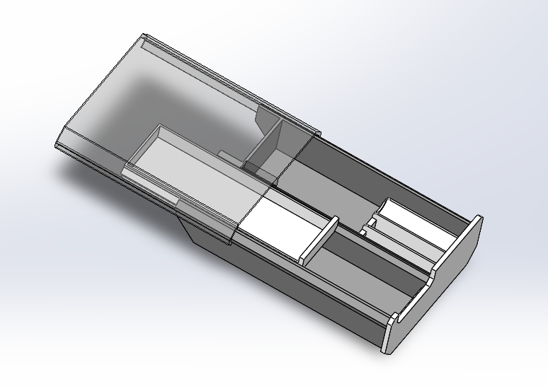

---

## P31 Lesson 18: Under-Desk Drawer Project, Part 6

### Core Summary

- The final lesson adds card, SD-card, SIM-card, and eject-pin slots, then reviews the design for strength, material use, sliding, sharp edges, and interference.
- A separate “3D-printed parts” assembly spreads out five components so problems hidden in the normal assembled state can be inspected.
- Adding 1 mm chamfers at rail entrances and slide ends improves insertion and motion; fillets on touch edges and storage corners reduce sharpness.
- Late fillets and chamfers replace original edges and may break linked sketches in other parts, so dimensions and coincident relations must be rebuilt.
- After fillet optimization, repeat section and interference checks; this lesson fixes interference between the DIY organizer and drawer fillets with matching 3.5 mm fillets.

### Common Mistakes

- Using the same depth for the eject-pin and SD-card slots, making the tiny eject pin difficult to retrieve;
- Inspecting only the main assembled state and missing problems hidden behind other components;
- Ignoring errors in linked sketches after adding rail fillets or chamfers;
- Adding fillets indiscriminately and creating interference with the replaceable module;
- Checking only simulated assembly motion without verifying the printed insertion chamfers and actual installation direction.

### Operation Notes

- Press S to open the shortcut bar for the current environment; frequently used commands can be added for quick access.
- Eject-pin/SD-card slots > Thin Feature cut > Thickness 2 mm > Depth 7 mm creates three narrow slots at once.
- Insert > Face > Move > raise the eject-pin slot bottom face 3 mm reduces its depth from 7 mm to 4 mm.
- Tile two assemblies side by side > Ctrl-drag components creates an exploded “3D-printed parts” inspection assembly.
- Multi-select components > right-click > Isolate displays only two or more related components for inspection.
- Rail entrances and slide ends > Chamfer 1 mm improves installation and sliding smoothness.
- If the drawer interferes with the DIY organizer, add 3.5 mm fillets to the organizer's four matching corners to clear the drawer fillets.
- File > Save As > 3MF exports the format used by the course slicer.

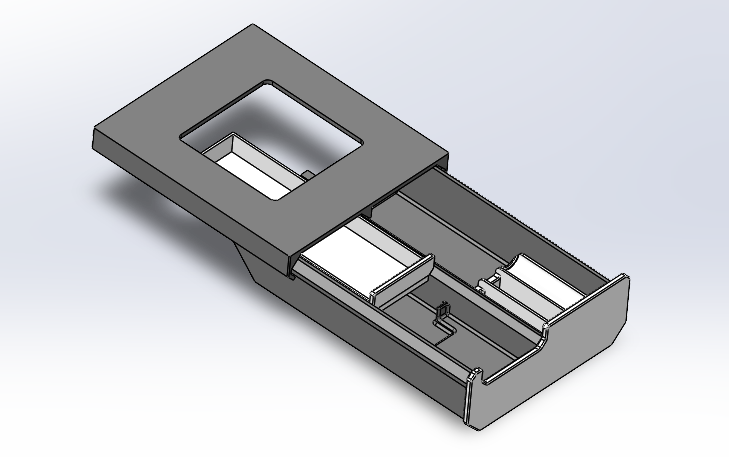
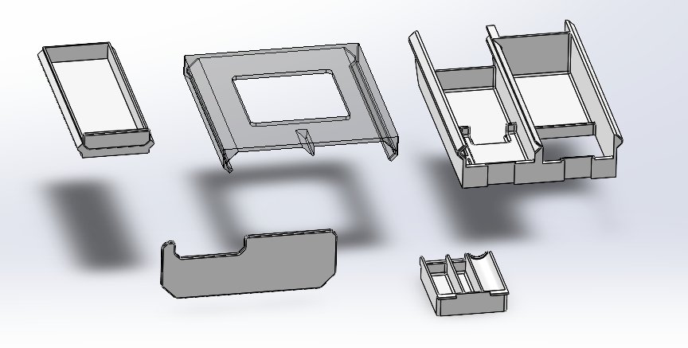

---

## P32 Supplementary Lesson: Printing and Installing the Drawer

### Core Summary

- After importing the 3MF into the slicer, split it into objects, orient and arrange each part individually, and print this project on two build plates.
- The lesson uses a 0.2 mm Standard preset with top-surface ironing and normal automatic supports enabled.
- Before printing, check support conflicts, out-of-bounds parts, the build plate, and nozzle condition; ignore a slicing warning only after confirming the job is actually printable.
- Install the DIY organizer first, then slide the large drawer into the rails, add the small drawer, and press the front cover fully into the dovetails.
- Attach the rails beneath the desk with 1 mm nano tape at six locations and press every pad firmly.

### Common Mistakes

- Failing to use Split to Objects after import, so all parts move together and cannot be arranged independently;
- Placing a part outside the build plate or resting it on a small, unstable face;
- Forcing supports under every 45-degree slope, wasting material and degrading the surface;
- Ignoring a support-conflict warning before checking the conflict location and prior test experience;
- Reversing the drawer orientation or failing to press the dovetail front cover fully home;
- Using too little nano tape or failing to press each attachment point firmly.

### Operation Notes

- Slicer > right-click > Split to Objects allows each part to be moved and rotated independently.
- After automatic arrangement, inspect the plate manually to keep every part within bounds and minimize the number of plates.
- Print Preset > 0.2 mm Standard > Top Surface Ironing enabled improves exposed top surfaces.
- Support > Normal (Auto) enabled supports suspended regions inside the drawer.
- Slice one plate at a time to review time, material, supports, and warnings for each plate.
- Apply 1 mm nano tape at six rail-edge locations and press firmly to mount the drawer beneath the desk.

---

# Phase 5: Drawings and Course Direction (P33–P35)

## P33 Lesson 19: Engineering Drawings, Part 1

### Core Summary

- An engineering drawing is a technical manufacturing document; create it directly from a part, select a GB sheet size, and place front, projected, and isometric views.
- Dimensions, tolerances, surface finish, datums, and geometric tolerances collectively communicate manufacturing requirements; annotations should be complete without duplication.
- Section, Detail, Broken-out Section, and Break views reveal internal features, enlarge local details, expose a local interior, and shorten long parts respectively.
- The drawing remains linked to the source part, so drawing views and related dimensions update when the model changes.

### Common Mistakes

- Starting with an unrelated blank drawing instead of creating it from the target part and establishing the correct link;
- Repeating the same dimension in multiple views or within a dimension chain;
- Leaving a threaded diameter shown as an ordinary “Ø5” instead of changing it to an M5 thread callout;
- Applying a Break view to a part that does not need one, making the drawing harder to read;
- Failing to rebuild and inspect dimensions, views, and tolerances after changing the source model.

### Operation Notes

- File > Make Drawing from Part > GB A4 creates an associated drawing from the current part.
- View Palette > drag the Front view, then move the pointer to place projected and isometric views.
- Drawing View > context toolbar > Projected View adds more orthographic views.
- Dimension Properties > Tolerance/Precision sets bilateral or shaft/hole fit tolerances.
- Drawing > Section View/Detail View/Broken-out Section/Break View communicates internal and local details.
- Annotations > Surface Finish/Datum Feature/Geometric Tolerance/Centerline adds manufacturing requirements.
- Drawing view > right-click > Open Part switches to the linked source part.

---

## P34 Lesson 20: Engineering Drawings, Part 2 and Career Advice

### Core Summary

- A drawing title block can read custom properties from the part; material, name, designation, and designer should be maintained in the source model.
- Sheet scale and individual view rotation control the layout; Hole Callout can describe a standard hole's diameter, depth, countersink, and angle in one annotation.
- Assembly drawings use a workflow similar to part drawings and can include a bill of materials with designation, material, and other columns.
- A BOM can be saved as Excel for purchasing, manufacturing, or further table processing.

### Common Mistakes

- Double-clicking title-block text instead of entering data in the source part's custom properties;
- Filling “designation” and the template's “part number” with two conflicting numbering systems;
- Crowding views onto the sheet instead of reducing the sheet scale first;
- Dimensioning each countersunk-hole feature manually and omitting hole depth or countersink angle;
- Selecting the wrong BOM scope or column properties, leaving part, designation, or material information incomplete.

### Operation Notes

- Part > File Properties > Custom fills material, name, designation, and designer fields that update the title block.
- Sheet lower-right scale or Sheet Properties > Custom Scale changes the scale of the entire sheet.
- View > Rotate View > 90° changes the orientation of one drawing view.
- Dimension Properties > Leaders > Diameter changes a partial arc dimension from radius to diameter.
- Annotations > Hole Callout > select a hole edge automatically creates the standard hole description.
- Annotations > Tables > Bill of Materials > Parts Only creates an assembly BOM.
- BOM > right-click > Save As > XLS exports an Excel workbook.

---

## P35 Mechanical-Arm Project Course Introduction

### Core Summary

- Being able to model several parts is not the same as designing independently; complete project experience bridges software operation and engineering design.
- The advanced mechanical-arm course focuses on identifying and solving problems to produce a 3D-printable, working mechanism.
- Completing real small projects during university builds design workflow, manufacturing awareness, and troubleshooting experience early.

### Common Mistakes

- Stopping practice after learning basic commands instead of completing full projects;
- Pursuing appearance alone without validating assembly, motion, or manufacturability;
- Assuming that reproducing a drawing means being able to propose and implement a structure from scratch.

### Operation Notes

- This lesson introduces the advanced course and adds no new SOLIDWORKS operations.

---

# Phase 6: Oscillating Fan Base Project (P36–P43)

## P36 Lesson 21: Oscillating Fan Base Project, Part 1

### Core Summary

- Break the requirements into the motor, crank-rocker mechanism, rotating base, bearing support, switch, and power supply before defining their structural relationships.
- The rotating base uses two deep-groove ball bearings so overturning moment becomes radial load, which the bearings handle better.
- Select standard components before modeling; the enclosure shape and internal space must adapt to the motor and transmission mechanism.

### Common Mistakes

- Supporting the rotating base with only one bearing, which can subject it to overturning moment and cause wobble;
- Choosing upper and lower bearings with the same bore, making it difficult to pass the rotating shaft through them in sequence;
- Fully tightening the shoulder screw and nut, locking the connecting-rod joint;
- Finalizing the enclosure shape before fitting the mechanism, leaving no room for the motor or linkage.

### Operation Notes

- Concept design > sketch the relationships among power, transmission, support, switch, and enclosure on paper before modeling in SOLIDWORKS.
- Motor selection > a 5 V USB supply can use an approximately 6 V, 5 RPM geared motor; one crank revolution makes the rocker reciprocate twice.
- Bearing layout > pair upper and lower deep-groove ball bearings with different bores to simplify installation and stabilize rotation.
- Joint design > use clearance between the connecting-rod hole and the shoulder screw shank, and leave rotational clearance at the nut.
- 3D-printed threads > embed metal screws and nuts at loaded joints instead of printing small load-bearing threads.

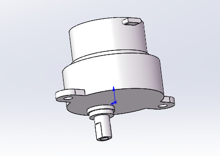
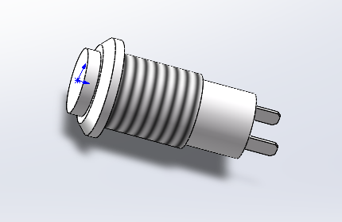
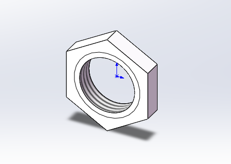

---

## P37 Lesson 22: Oscillating Fan Base Project, Part 2

### Core Summary

- Use the shoulder-screw and bearing specifications to define the rotating support, then model the enclosure, rotating base, and screw parts.
- Build, mate, and check interference inside the assembly to validate the initial concept iteratively.
- Toolbox generates standard bearings, while Save as Copy and Open quickly derives screws of similar design.

### Common Mistakes

- Selecting a bearing by designation alone without checking bore, outside diameter, and width;
- Leaving a revolve sketch open or failing to make the rotation centerline construction geometry, causing the feature to fail;
- Overwriting the original file while saving a similar part, losing the original size;
- Failing to inspect bearing end faces, shoulder-screw shank length, and motor clearance after assembly.

### Operation Notes

- Bearing selection > use 619/5 (5×13×4 mm) for the lower bearing and 619/9 (9×20×6 mm) for the upper bearing.
- Enclosure modeling > sketch a 60×120 mm profile on the Top Plane, extrude 60 mm, fillet 6 mm, shell 2 mm, and cut a 36 mm Through All bottom hole.
- Bearing seats > sketch a revolved section on the Front Plane and use Revolved Boss/Base; set upper and lower seat diameters to 20 mm and 13 mm.
- Toolbox > Task Pane > Design Library > Toolbox > GB > Bearings > Deep Groove Ball Bearings selects a size, generates the part, and inserts it into the assembly.
- Rotating base > draw a closed section and vertical construction centerline on the Front Plane, then use Revolved Boss/Base.
- Assembly mates > apply Concentric to cylindrical faces and Coincident to locating end faces.
- Cosmetic Thread > Insert > Annotations > Cosmetic Thread > select the cylindrical face and specify M4.
- Derived part > File > Save As > Save as Copy and Open, then change dimensions to create the M3 shoulder screw while preserving the M4 original.
- Model update > Ctrl+B rebuilds, Ctrl+S saves, and Ctrl+Tab switches among open documents.

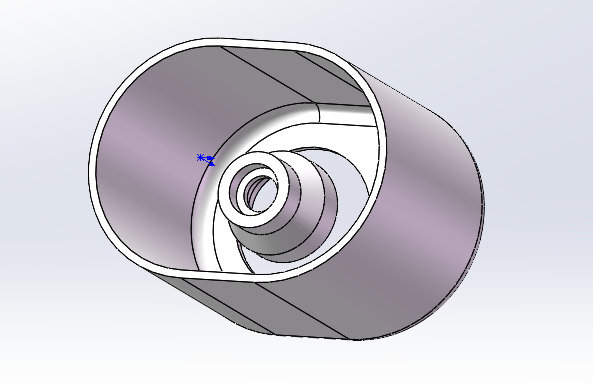
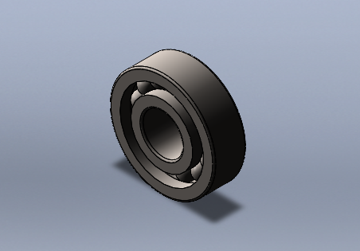
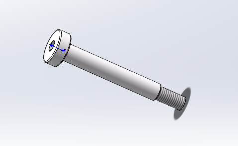
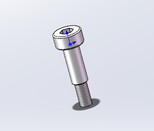
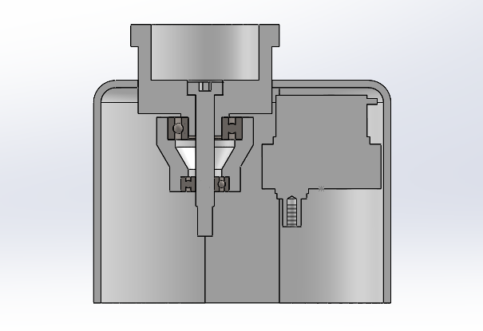

---

## P38 Supplementary Lesson 10: Version Issues and Pack and Go

### Core Summary

- Native files open in the same or newer SOLIDWORKS version, but an older version cannot directly open files saved by a newer one.
- Neutral formats such as STEP and Parasolid allow cross-version solid viewing but do not preserve the original feature tree.
- An assembly depends on its referenced part files; use Pack and Go to migrate, share, or create milestone backups of the complete project.

### Common Mistakes

- Sending only the assembly file and omitting its parts, causing missing components for the recipient;
- Assuming STEP retains the complete modeling history when a neutral file normally contains only imported bodies;
- Packing files without a prefix or suffix, creating duplicate names and incorrect references between project stages;
- Using an early service-pack release such as SP0 or SP1 for a complex assembly, which may be less stable.

### Operation Notes

- Version check > read the major version and SP release at the lower-left of the interface; prefer the mature SP5 release of that major version.
- Cross-version save > File > Save As > STEP or Parasolid lets an older version import the solid.
- Project packaging > File > Pack and Go > choose a destination folder or ZIP archive and save all referenced files.
- Package naming > add the lesson-stage suffix in Pack and Go to prevent same-name parts across milestones.
- Milestone archive > create a new package after each lesson so work can resume from the previous complete stage after an error.

---

## P39 Lesson 23: Oscillating Fan Base Project, Part 3

### Core Summary

- Model the crank, connecting rod, and rocker and assemble them so continuous motor rotation becomes reciprocating base motion.
- Use the shoulder-screw shank as the pivot, while a lock nut and stepped hole control axial clearance.
- Initial dimensions need not be final; first build a movable assembly, then iterate for interference, alignment, and available component sizes.

### Common Mistakes

- Testing the crank before fully constraining the motor, causing the motor to move with the linkage;
- Matching the joint hole exactly to the shoulder-screw shank diameter, making the assembled pivot too tight to rotate;
- Leaving an M4 Cosmetic Thread on an M3 screw and creating a feature-tree error;
- Selecting the wrong object while copying a part or adding a mate, creating duplicates or overdefined mates;
- Verifying only that the parts assemble without dragging through the full travel and missing linkage-to-enclosure interference.

### Operation Notes

- Crank connection > sketch a 5 mm double-flat hole from the motor shaft, cut 4 mm, and use Hole Wizard for an ISO M3 countersunk hole.
- Pivot hole > for a 4 mm shoulder-screw shank, set the connecting-rod hole to approximately 4.15 mm for rotational clearance.
- Motor positioning > fully constrain the motor with Concentric, Coincident, and Distance mates; initially set 2 mm between its top and the enclosure's inner top.
- Rocker holes > use 5.1 mm for the M4 shoulder-screw shank hole and 4.2 mm for the thread-clearance hole.
- Assembly check > rotate the crank through a full revolution and watch for interference among the connecting rod, rocker, screws, and enclosure.
- Isolate parts > select the parts in the assembly > right-click > Isolate, then edit the displayed local details.
- Copy part > Ctrl-drag a part in the assembly to duplicate the same shoulder screw or nut.
- Lock nut > Hole Wizard > Tapped Hole > specify M4 or M3; derive the similar size with Save as Copy.

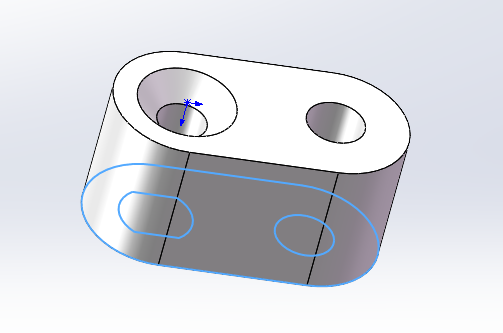
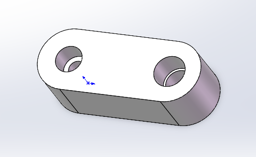
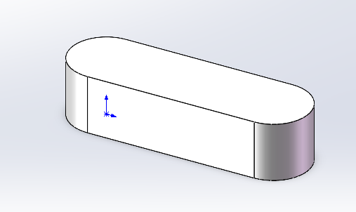
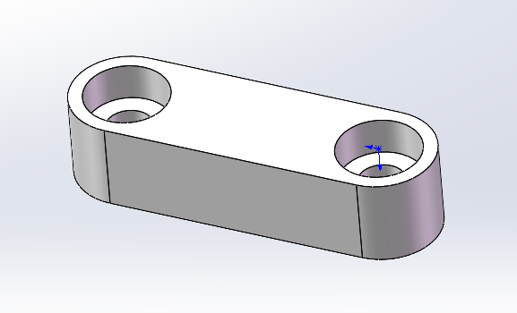
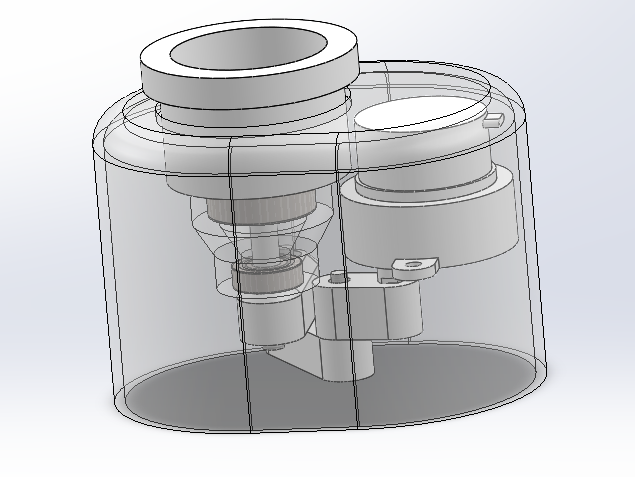
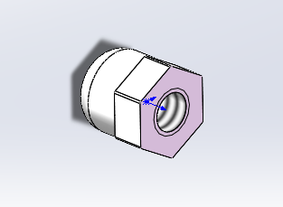
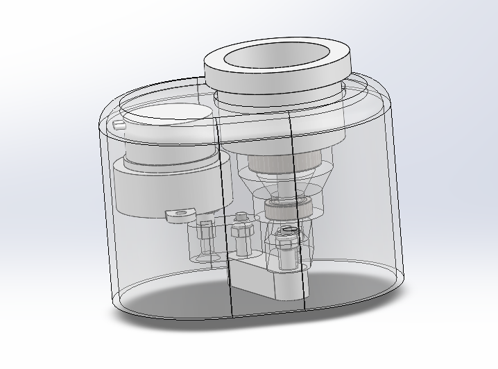

---

## P40 Lesson 24: Oscillating Fan Base Project, Part 4

### Core Summary

- Reduce the total crank-rocker height by shortening shoulder screws, thinning members, and recessing the nuts.
- Create a bushing and bottom plate in context, then add motor mounts and a switch opening to the enclosure.
- Combine Isolate, transparency, section views, and mechanism dragging to inspect clearance, interference, and assembly feasibility.

### Common Mistakes

- Shortening only the screw without adjusting the connecting rod, nut, and mating faces, misaligning the assembly;
- Making a hexagonal recess too small for the nut or too large to locate it securely;
- Using the wrong reference-plane direction or offset, placing the motor mount on the wrong side of the enclosure;
- Using Up to Body without selecting the enclosure, or extruding in the wrong direction, so the mount does not join the enclosure;
- Giving the bottom plate no clearance from its locating groove, preventing a printed plate from fitting.

### Operation Notes

- Mechanism compression > reduce the connecting-rod/shoulder-screw engagement from 4.5 mm to 2.5 mm and the M3 screw shank length from 10 mm to 5 mm.
- Nut recess > sketch a hexagon on the crank or rocker face and Cut-Extrude so the lock nut sits inside the part and lowers the assembly height.
- Rotating support > shorten the M4 shoulder-screw shank from 30 mm to 25 mm and reduce bearing spacing from 10 mm to 9 mm.
- Bushing > Assembly > Insert Components > New Part > sketch the revolved section from bearing clearances, Revolved Boss/Base, and set the center hole to 5.15 mm.
- Offset Plane > Reference Geometry > Plane > select the enclosure inner face and offset 24.8 mm for the motor-mount sketch.
- Mounting platforms > sketch two equal-width slots on the offset plane, Extruded Boss/Base > Up to Body, and select the enclosure.
- Switch hole > sketch an 8.2 mm circle on the enclosure top, cut Through All, then apply Concentric and face Coincident mates to the switch and nut.
- Bottom-plate groove > Convert Entities from the enclosure's lower inner loop, offset inward 1.5 mm, and extrude inward to form a 2 mm-deep locating seat.
- Bottom plate > create an in-context part, convert the groove outline, offset 0.1 mm for assembly clearance, and extrude to 2 mm thickness.

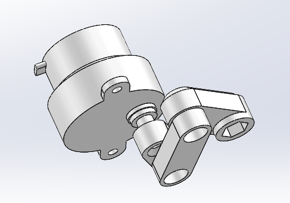
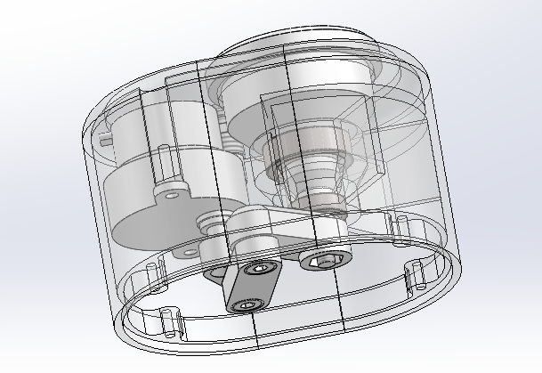

---

## P41 Lesson 25: Oscillating Fan Base Project, Part 5

### Core Summary

- Join the bearing seat to the enclosure and reinforce it with thin ribs; measure approximately 60 degrees between the mechanism's two extreme positions.
- Add manufacturable holes, bosses, chamfers, and locating features for the motor, rotating base, bottom plate, and EVA feet.
- When a standard screw does not match the software's hole library exactly, choose a similar hole type and override it with custom dimensions.

### Common Mistakes

- Placing a reinforcement rib where it blocks access to the switch nut, preventing tool tightening after installation;
- Measuring only one mechanism position instead of both extremes, so the true oscillation angle is unknown;
- Overlapping bottom-plate countersinks with motor mounting holes, weakening the structure or causing screw interference;
- Using a center rectangle to locate holes and having its center point interpreted by Hole Wizard as an extra hole position;
- Adding EVA feet without locating edges, making manual placement inaccurate.

### Operation Notes

- Join bearing seat > Convert Entities from the enclosure inner loop on the seat bottom and extrude 3 mm to make a connected structure.
- Reinforcement ribs > use open-line sketches with Thin Feature extrusion, Thickness 2 mm, and Up to Body.
- Measure oscillation > on the Top Plane, draw lines along the rocker's two extreme positions and Smart Dimension their included angle at approximately 60°.
- Motor pilot holes > Hole Wizard > Simple Hole > Diameter 2.5 mm > Depth 10 mm for M3 self-tapping screws.
- Entry chamfers > add a 2 mm chamfer at the rotating-base entrance and approximately 1.5 mm × 45° on the outer edge for insertion and appearance.
- Anti-slip slots > sketch a 31×2 mm rectangle on the rotating-base top, cut Through All, and circular-pattern 10 instances around the center axis.
- Bottom-plate countersinks > choose the closest countersunk hole in Hole Wizard, enable custom sizing, and use approximately 2.8 mm bore and 4.8 mm countersink diameter.
- Bottom-plate screw posts > add four 6 mm bosses inside the enclosure, then cut 2.11 mm-diameter, 10 mm-deep self-tapping pilot holes.
- EVA feet > create four in-context pads 8 mm in diameter and 1.5 mm thick, with 8.5 mm locating thin walls on the bottom plate.

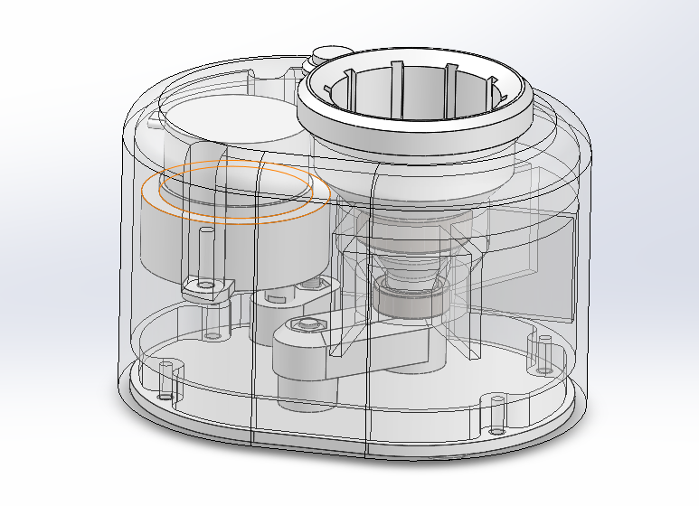
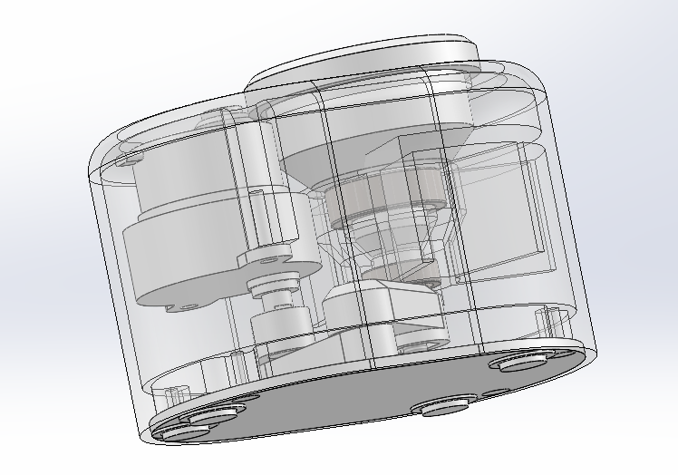

---

## P42 Lesson 26: Oscillating Fan Base Project, Part 6

### Core Summary

- Complete the USB cable exit, crank guard, cable-storage groove, and magnet mount so wiring clears the moving mechanism and can be stored.
- Perform final dynamic and section checks, correcting interference involving the connecting rod, rocker, screws, ribs, and bearing seat.
- Create a separate “3D-printed parts” assembly to distinguish custom printed parts from purchased standard components.

### Common Mistakes

- Cutting an enclosure opening while the bottom-plate sketch still references converted enclosure edges, causing its outline to update or fail;
- Making the USB slot exactly the cable width and leaving sharp corners, causing difficult routing or damaged insulation;
- Clearing the crank with a cable guard but ignoring the motor and creating new interference;
- Swapping the sweep profile and path, or using nonintersecting sketches, causing the Swept Cut to fail;
- Assuming a static check proves full motion is clear when hidden interference appears only at extreme positions.

### Operation Notes

- Remove external reference > delete Convert Entities relations from the bottom-plate sketch, then set the existing outline to Fixed before changing the enclosure.
- USB slot > sketch a 35° path on the enclosure bottom, use a symmetric Thin Feature cut of 3.3 mm per side and 5.3 mm depth, then add Full Round fillets.
- Cable guard > draw a 16.5 mm-radius arc from the crank motion envelope on the bottom plate, Thin Feature extrude 2.5 mm, and revise its height for motor clearance.
- Cable-storage groove > draw the groove profile on the Front Plane, convert the enclosure bottom as a closed path, and use Swept Cut to form the ring groove.
- Magnet mount > create a plane tangent to the side arc, sketch a 12.4 mm circle, and Thin Feature extrude to the enclosure inner face.
- Sketch Text > select a guide arc > Sketch Text > set the arc to construction geometry, then Cut-Extrude 0.3 mm.
- Dynamic check > drag the crank through a full revolution with section view enabled and eliminate interference among the rod, rocker, screws, and enclosure ribs.
- Printed-part collection > create a new assembly and insert the enclosure, bottom plate, rotating base, crank, connecting rod, rocker, bushing, and feet individually.

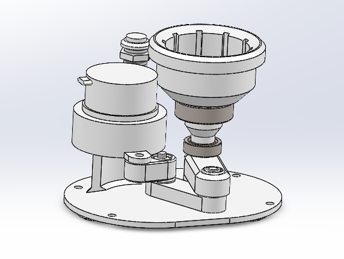
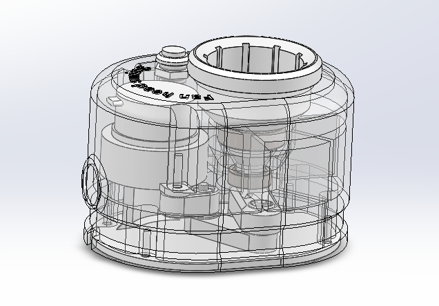
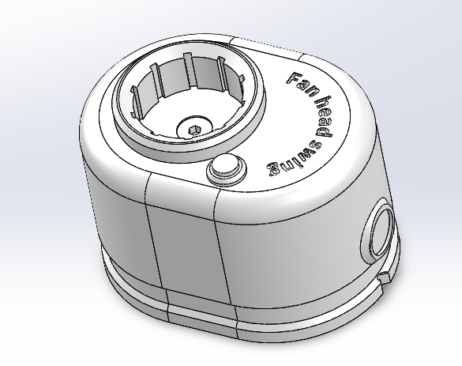
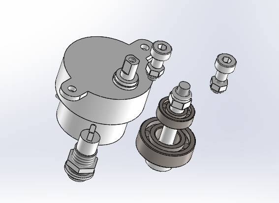
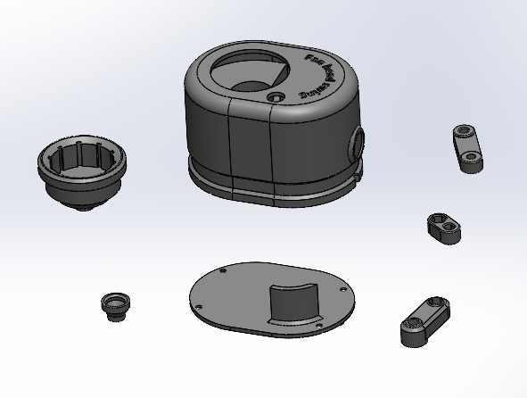

---

## P43 Supplementary Lesson: Oscillating-Base Assembly

### Core Summary

- 3D-printed parts require cleaning, test fitting, and occasional adjustment; a collision-free digital model does not guarantee first-try physical assembly.
- Install bearings and the rotating support first, followed by the crank-rocker mechanism, switch, motor, bottom plate, feet, and magnets; manually check tightness before powering on.
- Test under power in stages and diagnose each sticking point; feed real assembly findings back into the model instead of relying only on physical filing.

### Common Mistakes

- Forcing a bearing into an undersized or rough FDM hole, which can damage the print or tilt the bearing;
- Tightening a pivot nut until the mechanism locks, or leaving it so loose that it wobbles or detaches;
- Failing to pass the switch nut over the wires before soldering, making final installation impossible;
- Heating the switch too long while soldering, damaging plastic parts or internal contacts;
- Mixing parts from different design revisions and misdiagnosing the resulting interference as a dimension error;
- Installing the bottom plate after confirming only that the motor starts, without running several cycles to reveal periodic sticking.

### Operation Notes

- Printed-part finishing > remove burrs from holes and mating faces, test-fit bearings gradually, and trim with a knife or file when necessary.
- Pivot assembly > adjust the shoulder screw and lock nut until the joint rotates smoothly without obvious axial play.
- Switch wiring > place the mounting nut over the wires before soldering, hold it with needle-nose pliers, and minimize heating time.
- Staged testing > rotate the crank manually after installing the linkage, then power it for several cycles and install the bottom plate only after confirming smooth motion.
- Revision check > verify by part name, dimension, or marking that every printed part belongs to the same design revision before assembly.
- Design loop > record every filed location and assembly problem, then update clearances, chamfers, or reliefs in SOLIDWORKS.

---
