# SolidWorks 学习笔记

> 当前学习进度：17 / 43  
> 本笔记按实际学习进度更新，每课仅保留：核心总结、易错点、操作笔记。

<!-- video-course-notes-progress: P17/43 -->

# 第一阶段：界面与草图基础（P01～P08）

## P01 第一课：教程简介、软件界面及基础操作

### 核心总结

- SOLIDWORKS 主要建立零件、装配体和工程图三类文件，不同文件会显示对应的工具和设计树内容。
- 零件建模的基本流程是：选择平面 → 绘制草图 → 尺寸约束 → 创建特征。
- 设计树记录每一步建模操作；视图旋转和正视于只改变观察方向，不改变模型本身。

### 易错点

- 新建零件后没有立即保存，也没有在建模过程中阶段性保存；
- 未选择基准面就开始画草图；
- 矩形仍为蓝色时误以为已经完全定义；
- 把旋转视角误认为改变了模型方向；
- 没有展开拉伸特征，找不到它所使用的草图。

### 操作笔记

- Ctrl+N可以新建文件，Ctrl+S可以保存当前文件。
- 草图-草图绘制-前视基准面，可以在前视基准面建立草图。
- 草图-中心矩形，以原点为中心绘制矩形并标注两边100 mm，可得到完全定义的正方形。
- 特征-拉伸凸台/基体-深度100 mm，可以生成边长100 mm的正方体。
- 按住鼠标中键拖动，可以自由旋转观察模型。
- 视图定向-正视于，可以让视线垂直于所选平面。

---

## P02 学习指导与学习地图介绍

### 核心总结

- 学习时应同时打开视频和 SOLIDWORKS，边看边操作，不能只观看不练习。
- 学习顺序分为草图、零件、装配体、工程图四个阶段，每个阶段都要配合练习题。
- 基础功能学完后要通过完整项目继续训练，真正的掌握标准是能够独立完成设计。

### 易错点

- 只看视频或抄步骤，没有在软件中同步操作；
- 连续看完课程却跳过学习地图安排的阶段练习；
- 练习遇到困难便直接放弃，没有回看对应课程和练习讲解；
- 把“看懂”当成“学会”，没有进行闭卷复做；

### 操作笔记

- 本课没有新增软件操作。

---

## P03 第二课：草图绘制

### 核心总结

- 常用草图工具包括直线、矩形、圆、圆弧、槽口、圆角、倒角和点，绘制方式可通过图标和软件提示判断。
- 草图通常先绘制大致形状，再用几何关系和智能尺寸确定位置与大小。
- 蓝色草图仍有自由度，黑色草图为完全定义；冲突的几何关系会引起报错。
- 圆心、线段端点和矩形角点都属于点，点也可以作为阵列中心等定位元素。

### 易错点

- 同一条直线同时添加水平和垂直等冲突关系；
- 绘制完草图后点击退出按钮，误放弃本次编辑；
- 只标注轮廓大小，没有标注轮廓相对原点的位置；
- 绘制槽口时混淆中心线长度与槽宽；
- 忽略鼠标旁的水平、垂直和相切提示，生成错误关系。

### 操作笔记

- Ctrl+Z可以撤销上一步操作。
- 草图右上角-绿色对勾，可以保存并结束草图编辑。
- 设计树-草图-右键-编辑草图，可以重新进入已有草图。
- 按住鼠标右键并向上滑动，可以快速启动智能尺寸。
- Ctrl+鼠标中键拖动，可以平移草图视窗。
- 草图-圆角，选择转角并输入半径，可以把两条边替换为相切圆弧。

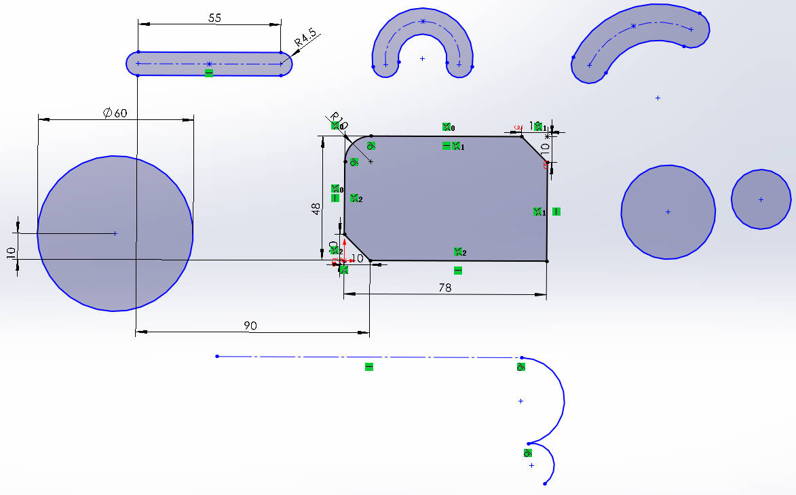

---

## P04 第三课：草图几何关系与编辑

### 核心总结

- 多选草图实体后可添加垂直、平行、相等、共线、相切和对称等几何关系。
- 强劲裁剪可连续划过并删除多余线段，按住 Shift 拖动还可以延伸实体。
- 转换实体引用用于把已有模型边线或草图投影到当前草图中。
- 等距实体可对模型边线和草图实体建立指定距离、方向或双向的偏移轮廓。

### 易错点

- 未按住 Ctrl 多选完整对象，导致几何关系无法添加或加错对象；
- 同时添加重复尺寸和几何关系，造成草图过定义；
- 使用强劲裁剪时划过需要保留的线段；
- 转换实体引用后忽视新草图与原边线或原草图之间的关联；
- 没有确认当前仍处于草图编辑状态，后续命令作用对象错误。

### 操作笔记

- 按住Ctrl依次选择多个草图实体，可以为它们添加共同的几何关系。
- 草图-裁剪实体-强劲裁剪，按住鼠标左键划过线段可以连续裁剪。
- 强劲裁剪状态下按住Shift拖动实体，可以延伸线段。
- 草图-转换实体引用，可以把已有边线或草图投影到当前草图。
- 草图-等距实体，可以设置等距距离、方向或双向等距。
- 智能尺寸依次选择两条直线，可以标注两线夹角。

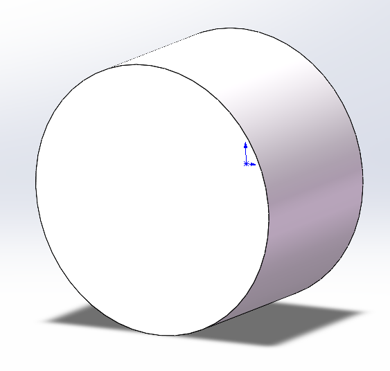

---

## P05 附加课1：默认模板无效与转换实体引用

### 核心总结

- “默认模板无效”通常是系统选项中的零件或装配体模板路径没有指向实际模板文件。
- 文档属性控制制图标准、尺寸字体等设置；修改后必须另存为模板并重新指定为默认模板，才能应用到新文件。
- 转换实体引用可以直接提取模型面、边线或已有草图的轮廓，减少重复绘制和尺寸不一致。

### 易错点

- 提示默认模板无效时只点击确定，没有修复模板路径；
- 修改尺寸字体后直接关闭文件，没有保存为模板；
- 混淆零件模板 PRTDOT 和装配体模板 ASMDOT；
- 只更换零件模板，忘记单独修改装配体模板；
- 转换实体引用前没有进入目标草图，或选择了错误的面。

### 操作笔记

- 系统选项-默认模板，重新选择有效的零件和装配体模板，可以解决默认模板无效。
- 文档属性-尺寸-字体-高度5.5 mm，可以放大尺寸文字。
- 文件-另存为-零件模板（*.prtdot），可以保存修改后的零件模板。
- 文件-另存为-装配体模板（*.asmdot），可以保存修改后的装配体模板。
- 草图-转换实体引用-选择实体面，可以提取该面的边界轮廓。(先草图，后实体)

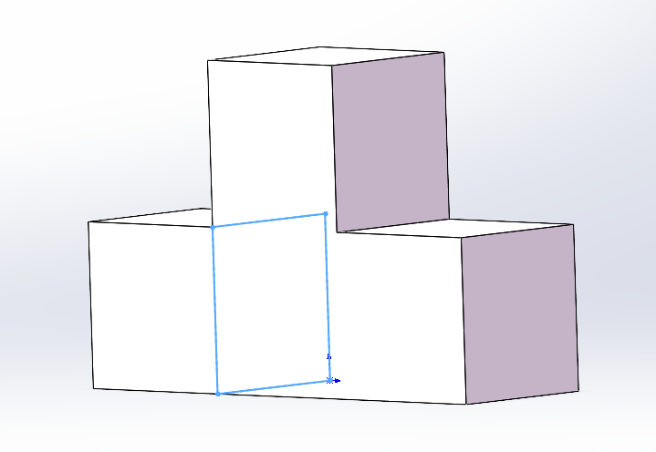

---

## P06 附加课2：草图绘制思路

### 核心总结

- 草图先画完整轮廓并检查自动几何关系，再用智能尺寸逐步完全定义。
- 属性栏中直接填写线长不能代替智能尺寸；真正控制草图的是驱动尺寸和几何关系。
- 完全定义既要确定形状和大小，也要通过原点、基准或定位尺寸确定整体位置。
- 草图仍为蓝色时，可以拖动实体观察剩余自由度，从移动方向判断缺少的约束。

### 易错点

- 在直线属性栏填写长度后，误以为线长已经被约束；
- 尺寸全部标完，却没有让草图与原点建立位置关系；
- 把从动尺寸取消从动，造成尺寸重复和草图过定义；
- 接受软件自动生成的垂直、相切等无关关系；
- 草图报错后盲目删除大量正确关系，没有先拖动检查自由度。

### 操作笔记

- 智能尺寸-选择直线，可以建立能够驱动草图的长度尺寸。
- 状态栏-单位-MMGS，可以把当前零件长度单位改为毫米。
- 尺寸-属性-其他-从动，可以切换驱动尺寸和从动尺寸。
- 按住Ctrl选择草图实体和原点-重合，可以建立草图与原点的定位关系。
- 拖动蓝色草图实体，可以判断草图还缺少哪个方向的约束。

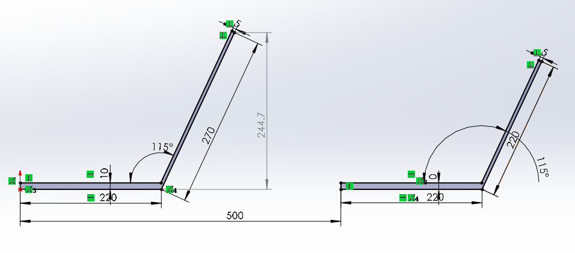

---

## P07 第四课：草图镜像、阵列与进阶绘制练习

### 核心总结

- 镜像实体需要分别指定“要镜像的实体”和“镜像轴”，镜像轴必须是直线。
- 线性草图阵列可设置两个方向的数量、距离和角度，阵列数量包含原始实体。
- 圆周草图阵列需要中心点、阵列实体、实例数和角度，还可以使用等间距和跳过实例。
- 复杂草图应拆成多个局部，按“绘制一部分—添加关系—标注尺寸—完全定义”逐段完成。

### 易错点

- 没有激活“镜像轴”选择框，把轴线误加入待镜像实体；
- 误以为阵列数量不包含原始实体，导致多出一个实例；
- 圆周阵列选错旋转中心；
- 复杂草图一次全部画完，最后难以定位欠定义或冲突位置；
- 把水平距离、垂直距离和线段真实长度标错。

### 操作笔记

- 草图-镜像实体，先选择要镜像的实体，再激活镜像轴栏并选择直线。
- 线性草图阵列-实例数，填写的数量包含原始实体。
- 线性草图阵列-X轴/Y轴，可以分别设置数量、距离和方向角度。
- 圆周草图阵列-阵列中心，可以选择圆心或独立草图点。
- 圆周草图阵列-可跳过的实例，可以取消指定位置的阵列实体。

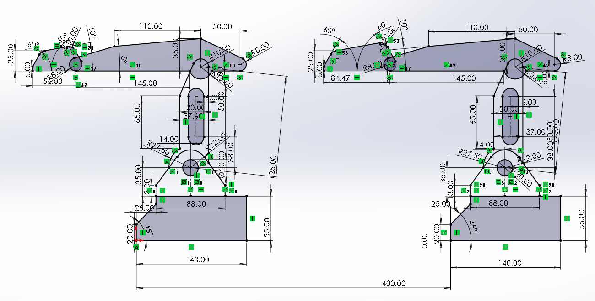

---

## P08 练习题介绍

### 核心总结

- 课程内容需要通过草图、零件、装配体和工程图练习及时巩固，否则操作会快速遗忘。
- 练习题应与学习阶段配套：学完一类功能，立即完成对应类型的题目，再继续下一阶段。
- 装配练习训练已有零件的组合，完整实战则训练从零设计零件并完成装配，两者不能互相替代。

### 易错点

- 学完课程后长期不练习，等到使用时才发现操作已经遗忘；
- 跳过附加课或打乱课程顺序，直接挑战超出当前阶段的题目；
- 一遇到困难就查看答案，没有先独立尝试；
- 只做现成零件的装配题，没有完成从零设计项目；
- 把所有练习留到整套课程结束后一次完成。

### 操作笔记

- 本课没有新增软件操作。

---

# 第二阶段：零件特征与模型修改（P09～P20）

## P09 附加课3：特征预习

### 核心总结

- 拉伸凸台/基体的本质是确定“从哪里开始”和“在哪里结束”，并沿指定方向把二维轮廓变为实体。
- 拉伸起始位置可以是草图基准面，也可以相对草图基准面等距。
- 拉伸终点可以使用给定深度、两个方向、两侧对称、成形到一面或离指定面指定距离等条件。
- 以模型面控制终止位置比手工计算固定深度更能表达几何关系。

### 易错点

- 混淆起始条件与终止条件，在错误的选项中修改距离；
- 改变等距数值后忘记检查反向，实体出现在草图另一侧；
- 需要两侧等长拉伸时分别填写方向一、方向二，增加不必要的参数；
- 用固定深度勉强对齐已有端面，模型修改后不再齐平；
- 使用“离指定面指定的距离”时没有确认等距方向。

### 操作笔记

- 拉伸凸台/基体-方向1-反向，可以切换拉伸方向。
- 拉伸凸台/基体-方向2（勾选），可以从草图向两个方向分别拉伸。
- 拉伸凸台/基体-终止条件-两侧对称，可以从草图向两侧等距拉伸。
- 拉伸凸台/基体-起始条件-等距，可以从距草图基准面指定位置开始拉伸。
- 拉伸凸台/基体-终止条件-成形到一面，可以让拉伸在所选模型面结束。

---

## P10 第五课：特征成型与设计树

### 核心总结

- 凸台类特征增加材料，切除类特征去除材料；拉伸、旋转、扫描和放样分别对应不同的成型方式。
- 拉伸凸台/基体需要设置起始条件、方向和终止条件，可按已有顶点、面或实体控制终点。
- 薄壁特征把封闭轮廓的边线拉伸成有厚度的壁，可控制厚度方向、两侧对称或双向厚度。
- 设计树记录建模顺序；编辑上游草图或特征时，引用它的下游特征会随之更新。

### 易错点

- 新建练习文件后没有先保存；
- 设置等距起始或终止面后没有检查反向；
- 混淆“成形到一面”“成形到实体”和“离指定面指定的距离”；
- 薄壁特征的厚度方向选反，模型向轮廓外侧增长；
- 修改上游草图前没有考虑后续特征的引用关系。

### 操作笔记

- 拉伸凸台/基体-起始条件-等距，可以改变拉伸开始位置。
- 拉伸凸台/基体-终止条件，可以选择下一面、顶点、面、实体或两侧对称。
- 拉伸凸台/基体-薄壁特征，可以设置壁厚、方向、两侧对称或双向厚度。
- 键盘F，可以让模型重新充满零件视窗。
- 设计树-特征-编辑特征，可以重新修改已有特征参数。
- 设计树-展开特征-草图-编辑草图，可以修改特征使用的原始草图。

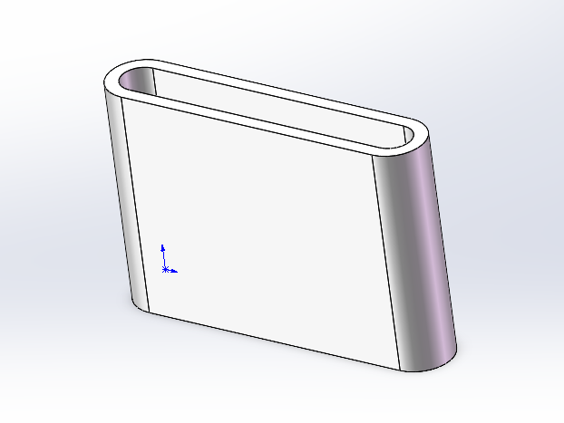

---

## P11 第六课：特征成型2

### 核心总结

- 拉伸切除可使用定深、完全贯穿、成形到一面等终止条件，实体面和基准面都能作为终止面。
- 参考基准面用于确定新的建模位置，也可以控制拉伸或切除的终点。
- 扫描由轮廓和路径组成，两者必须相交；螺旋线配合圆形轮廓可以快速生成弹簧。
- 旋转特征需要截面和旋转轴；普通直线也能作轴，但构造线更容易被软件自动识别。

### 易错点

- “成形到一面”选错方向、实体面或基准面，导致切除结果不符合预期；
- 创建了基准面却处于隐藏状态，误以为基准面没有生成；
- 扫描路径没有穿过轮廓，导致扫描失败；
- 把“螺旋线/涡状线”当成草图命令，未在“特征-曲线”中查找；
- 旋转轴画成普通实线后，忘记在旋转特征中手动选择轴线。

### 操作笔记

- 文件-另存为，可以保留上一节模型并在副本上继续练习。
- 拉伸切除-终止条件-成形到一面，可选择实体面或基准面作为切除终点。
- 特征-参考几何体-基准面，选择前视基准面并等距5 mm，可创建新的参考基准面。
- 视图工具栏-隐藏/显示项目，可统一隐藏或显示基准面。
- 特征-曲线-螺旋线/涡状线，设置螺距5 mm、圈数10，可建立弹簧路径。
- 插入-注解-装饰螺纹线，选择直径10 mm的圆边可建立M10装饰螺纹。

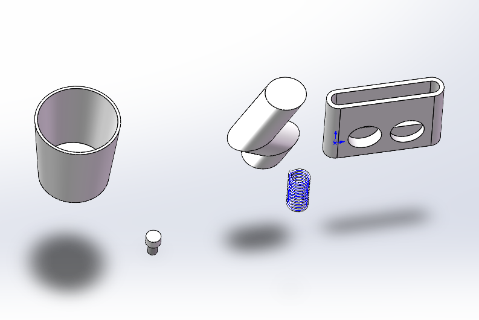

---

## P12 附加课4：草图绘制面、实线与构造线的区别

### 核心总结

- 普通二维草图只能建立在基准面或实体平面上，不能直接建立在圆柱等曲面上。
- 曲面位置需要特征时，可先创建合适的参考基准面；相比写死距离，几何相切关系更稳定。
- 实线参与特征成型，构造线只作定位、约束或旋转轴，不参与封闭轮廓计算。

### 易错点

- 在圆柱曲面上直接进入普通二维草图；
- 键槽切除从圆柱中心开始，忘记调整切除起始位置；
- 只设置相切关系，未用前视基准面限制新基准面的方向；
- 把外轮廓边误设为构造线；
- 编辑旋转草图时误删系统补出的闭合实线。

### 操作笔记

- 系统选项-草图-在创建草图以及编辑草图时自动旋转视图以垂直于草图基准面（勾选），可以自动旋转正视草图。

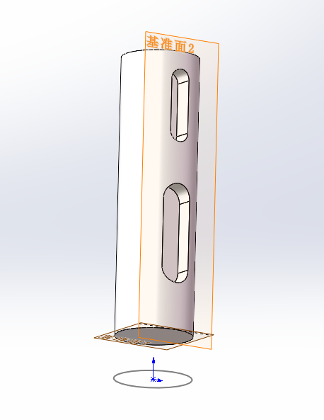
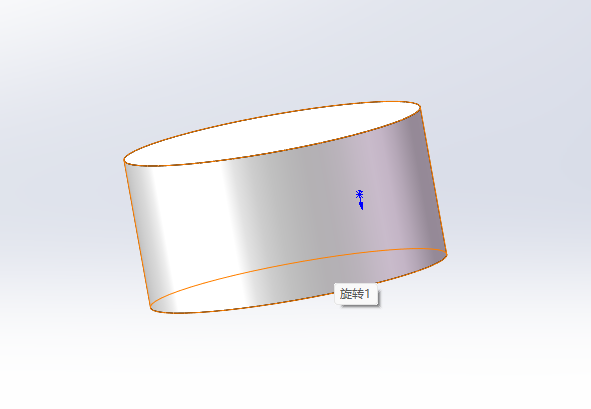

---

## P13 第七课：特征成型3

### 核心总结

- 旋转切除用截面绕轴线去除已有材料；空白零件没有材料，因此该命令不可用。
- 参考基准面最多可由三个点、线、面参考共同确定，关系可以是重合、平行、垂直、角度、等距或两侧对称。
- 剖视图和不同显示样式只改变观察方式，不会真实切割或修改模型。
- 圆角和倒角可以选择单条边或整个面；复杂场景还可使用变半径、面圆角和完整圆角。

### 易错点

- 在空白零件中直接寻找旋转切除，忽略必须先有实体材料；
- 用固定 12.5 mm 猜测正方体中面，没有使用两个面的两侧对称关系；
- 基准面参考之间的约束组合冲突，仍继续添加参考；
- 把剖视图误认为真实切割特征；
- 选择整个面添加圆角或倒角，误处理了该面周围全部边线。

### 操作笔记

- 参考几何体-基准面-选择相对两面-两侧对称，可以建立实体中心基准面。
- 快捷键 Alt+C 可以把刚绘制的直线切换为构造线。
- 参考几何体-基准面，最多可以使用三个点、线或面作为参考。
- 视图工具栏-剖视图，可以临时查看模型内部而不切割实体。
- 隐藏/显示项目-草图尺寸/草图几何关系，可以控制草图标注的显示。
- 特征-圆角/倒角，选择边线或面并设置尺寸，可以处理实体边缘。

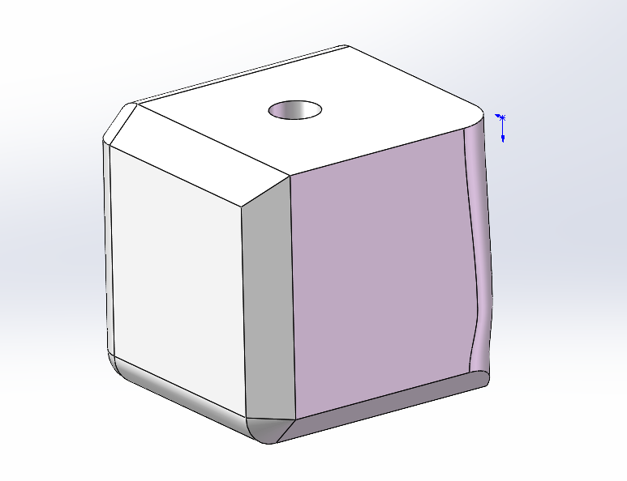

---

## P14 第八课：特征成型4

### 核心总结

- 异型孔向导通过孔型、标准、规格、终止条件和位置草图建立标准孔，定位点需要尺寸或关系约束。
- 特征线性阵列通过模型边线控制方向，可阵列特征或实体并跳过指定实例。
- 圆周阵列需要旋转轴；基准轴可以由原点和垂直平面等参考建立。
- 不相连的几何属于不同实体；镜像整个分离部分时应选择“要镜像的实体”，而不是“要镜像的特征”。

### 易错点

- 在异型孔向导中选好孔型后，忘记切换到“位置”放置定位点；
- 孔定位点仍为蓝色，没有标注到边线或基准的距离；
- 特征阵列选错方向边线或忘记反向；
- 圆周阵列找不到原点或基准轴，实际是被隐藏；
- 把不相连三角板作为特征镜像，触发“不连续实体”报错。

### 操作笔记

- 特征-异型孔向导-孔类型，选择国标、孔型、螺钉规格和终止条件。
- 异型孔向导-位置-选择平面-放置草图点，可以确定一个或多个孔的位置。
- 设计树-孔特征-编辑特征，可以修改孔型；编辑位置可以增删孔点。
- 特征-线性阵列，选择方向边线、阵列特征、距离和实例数，可以复制特征。
- 参考几何体-基准轴-选择原点和实体平面，可以建立垂直于该面的中心轴。
- 镜像-要镜像的实体，可以镜像与主体不相连的独立实体。

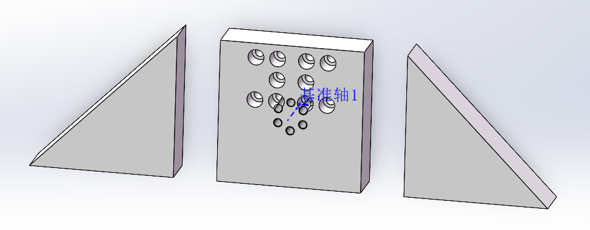

---

## P15 附加课5：草图封闭轮廓与所选区域

### 核心总结

- 开环草图执行拉伸时只能生成薄壁；封闭草图内部形成可用于实体特征的封闭区域。
- 模型边线不等于草图实线，看似被模型边线围住的区域仍可能是开环草图。
- 一幅草图包含多个封闭轮廓时，“所选轮廓”决定哪些区域参与当前特征，同一草图也可被多个特征使用。
- 特征只在一点或一条线接触并使局部厚度变为零时会报错；稍微移开轮廓或让切除分成独立实体可改变结果。

### 易错点

- 把模型边线当成草图的一部分，误判轮廓已经封闭；
- 开环草图自动激活薄壁后没有发现，生成了错误壁状实体；
- 多个封闭区域同时预览时，没有使用所选轮廓筛选；
- 圆与实体边线相切后直接切除，触发零厚度几何体；
- 依赖软件自动闭合轮廓，没有检查它补出的草图线。

### 操作笔记

- 草图-上色草图轮廓（勾选），可以显示封闭草图区域。
- 快捷键 Ctrl+8 正视草图。
- 快捷键 Ctrl+B 可以重建模型并刷新异常显示。
- 特征属性-所选轮廓，点击封闭区域可以控制该区域是否参与特征。
- 设计树-选择已有草图-创建特征，可以让同一草图继续用于其他特征。

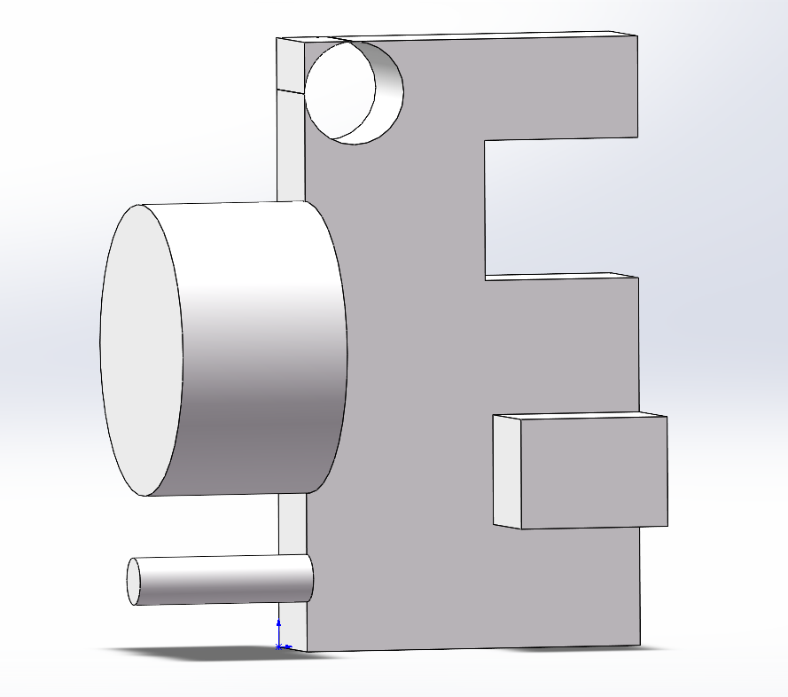

---

## P16 第九课：3D打印手机支架

### 核心总结

- 手机支架以侧面主截面为核心，通过两侧对称拉伸、完全贯穿切除、圆角和倒角完成主体结构。
- 结构尺寸应结合自己的手机宽度、充电接口和接触区域调整，不能只照抄示例。
- 三个底部支点可以确定一个平面，比整块打印底面更不容易因打印误差发生翘动。
- 草图文本可直接刻字；草图图片和样条曲线可辅助描 Logo，多区域切除时要逐个选择轮廓。
- 材质密度决定质量属性结果；评估工具可测量质量、距离和角度，模型可另存为中性格式交付打印。

### 易错点

- 认为项目只用了基础命令而跳过，漏学文本、图片、样条曲线、材质和测量；
- 没有测量自己的手机宽度，支架槽宽和充电缺口不适配；
- 手机接触处圆角过大，导致手机被顶起、接触面积变小；
- Logo 样条曲线没有闭合或漏选封闭区域，切除结果缺失；
- 用相近密度材质估重后，把结果当成打印件的精确质量。

### 操作笔记

- 拉伸凸台/基体-两侧对称，输入手机支架宽度，可以让主截面向两侧对称成型。
- 拉伸切除-方向1成形到一面-方向2完全贯穿，可以建立贯穿两侧的充电缺口。
- 草图-文本，设置文字、字体和大小后拉伸切除0.3 mm，可以在模型表面刻字。
- 工具-草图工具-草图图片，可以插入图片并调整透明度、大小和位置。
- 样条曲线-右键-显示控制多边形，可以拖动控制点调整曲线。
- 设计树-材质-右键-编辑材料，可以设置用于质量估算的材料密度。
- 评估-质量属性/测量，可以查看模型质量、距离和角度。
- 文件-另存为-STEP，可以导出课程使用的打印交付格式。

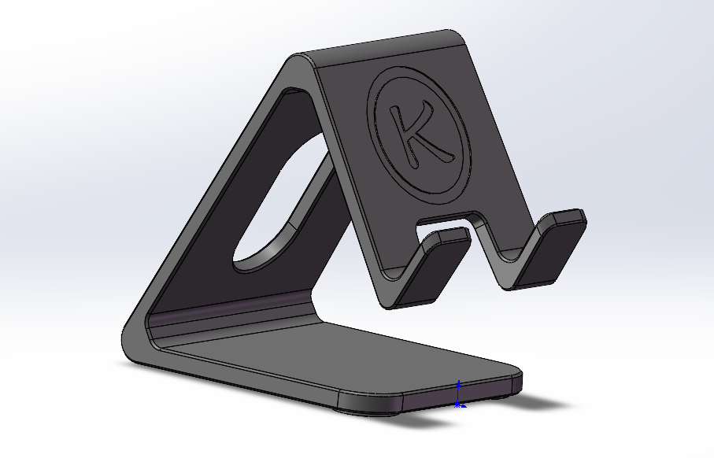

---

## P17 附加课8：修改特征与报错解决方法

### 核心总结

- 简单修改可直接双击草图尺寸或特征尺寸；复杂修改应进入“编辑草图”或“编辑特征”。
- 在图形区选择某个特征生成的面，可以反向定位设计树中的对应特征。
- 上游草图改变后，下游圆角、倒角等特征可能丢失原来的边或面引用而报错。
- 排错方法是“哪里报错就编辑哪里”，查看遗失参考并删除或重新选择新的边、面。

### 易错点

- 只在最终模型表面寻找尺寸，不知道应修改草图还是拉伸深度；
- 点击圆角面却以为选中的是最初的拉伸特征；
- 看到设计树黄色感叹号便从头重画，没有先编辑报错特征；
- 上游轮廓改变后，仍保留已不存在的红色虚线参考；
- 修复第一个报错后忽略其后的其他失败特征。

### 操作笔记

- 双击草图尺寸-输入新值-Ctrl+B，可以快速修改尺寸并重建模型。
- 设计树-草图-编辑草图，可以集中修改草图尺寸和轮廓。
- 双击特征尺寸，或特征-编辑特征，可以修改拉伸深度等参数。
- 图形区-点击特征生成的面，可以定位设计树中的对应特征。
- 报错特征-编辑特征-删除遗失参考-重新选择边或面，可以修复悬空引用。

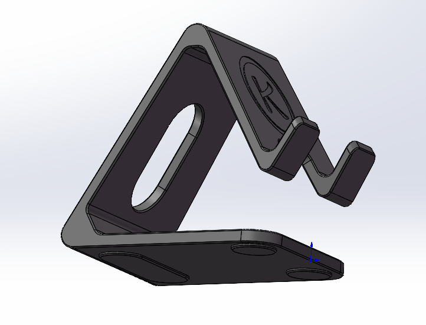

---
