# SolidWorks 学习笔记

> 当前学习进度：29 / 43  
> 本笔记按实际学习进度更新，每课仅保留：核心总结、易错点、操作笔记。

<!-- video-course-notes-progress: P29/43 -->

# 第一阶段：界面与草图基础（P01～P08）

## P01 第一课：教程简介、软件界面及基础操作

### 核心总结

- SOLIDWORKS 主要建立零件、装配体和工程图三类文件，不同文件会显示对应的工具和设计树内容。
- 零件建模的基本流程是：选择平面 → 绘制草图 → 尺寸约束 → 创建特征。
- 设计树记录每一步建模操作；视图旋转和正视于只改变观察方向，不改变模型本身。

### 易错点

- 新建零件后没有立即保存，也没有在建模过程中阶段性保存；
- 未选择基准面就开始画草图；
- 矩形仍为蓝色时误以为已经完全定义；
- 把旋转视角误认为改变了模型方向；
- 没有展开拉伸特征，找不到它所使用的草图。

### 操作笔记

- Ctrl+N可以新建文件，Ctrl+S可以保存当前文件。
- 草图-草图绘制-前视基准面，可以在前视基准面建立草图。
- 草图-中心矩形，以原点为中心绘制矩形并标注两边100 mm，可得到完全定义的正方形。
- 特征-拉伸凸台/基体-深度100 mm，可以生成边长100 mm的正方体。
- 按住鼠标中键拖动，可以自由旋转观察模型。
- 视图定向-正视于，可以让视线垂直于所选平面。

---

## P02 学习指导与学习地图介绍

### 核心总结

- 学习时应同时打开视频和 SOLIDWORKS，边看边操作，不能只观看不练习。
- 学习顺序分为草图、零件、装配体、工程图四个阶段，每个阶段都要配合练习题。
- 基础功能学完后要通过完整项目继续训练，真正的掌握标准是能够独立完成设计。

### 易错点

- 只看视频或抄步骤，没有在软件中同步操作；
- 连续看完课程却跳过学习地图安排的阶段练习；
- 练习遇到困难便直接放弃，没有回看对应课程和练习讲解；
- 把“看懂”当成“学会”，没有进行闭卷复做；

### 操作笔记

- 本课没有新增软件操作。

---

## P03 第二课：草图绘制

### 核心总结

- 常用草图工具包括直线、矩形、圆、圆弧、槽口、圆角、倒角和点，绘制方式可通过图标和软件提示判断。
- 草图通常先绘制大致形状，再用几何关系和智能尺寸确定位置与大小。
- 蓝色草图仍有自由度，黑色草图为完全定义；冲突的几何关系会引起报错。
- 圆心、线段端点和矩形角点都属于点，点也可以作为阵列中心等定位元素。

### 易错点

- 同一条直线同时添加水平和垂直等冲突关系；
- 绘制完草图后点击退出按钮，误放弃本次编辑；
- 只标注轮廓大小，没有标注轮廓相对原点的位置；
- 绘制槽口时混淆中心线长度与槽宽；
- 忽略鼠标旁的水平、垂直和相切提示，生成错误关系。

### 操作笔记

- Ctrl+Z可以撤销上一步操作。
- 草图右上角-绿色对勾，可以保存并结束草图编辑。
- 设计树-草图-右键-编辑草图，可以重新进入已有草图。
- 按住鼠标右键并向上滑动，可以快速启动智能尺寸。
- Ctrl+鼠标中键拖动，可以平移草图视窗。
- 草图-圆角，选择转角并输入半径，可以把两条边替换为相切圆弧。

---

## P04 第三课：草图几何关系与编辑

### 核心总结

- 多选草图实体后可添加垂直、平行、相等、共线、相切和对称等几何关系。
- 强劲裁剪可连续划过并删除多余线段，按住 Shift 拖动还可以延伸实体。
- 转换实体引用用于把已有模型边线或草图投影到当前草图中。
- 等距实体可对模型边线和草图实体建立指定距离、方向或双向的偏移轮廓。

### 易错点

- 未按住 Ctrl 多选完整对象，导致几何关系无法添加或加错对象；
- 同时添加重复尺寸和几何关系，造成草图过定义；
- 使用强劲裁剪时划过需要保留的线段；
- 转换实体引用后忽视新草图与原边线或原草图之间的关联；
- 没有确认当前仍处于草图编辑状态，后续命令作用对象错误。

### 操作笔记

- 按住Ctrl依次选择多个草图实体，可以为它们添加共同的几何关系。
- 草图-裁剪实体-强劲裁剪，按住鼠标左键划过线段可以连续裁剪。
- 强劲裁剪状态下按住Shift拖动实体，可以延伸线段。
- 草图-转换实体引用，可以把已有边线或草图投影到当前草图。
- 草图-等距实体，可以设置等距距离、方向或双向等距。
- 智能尺寸依次选择两条直线，可以标注两线夹角。

---

## P05 附加课1：默认模板无效与转换实体引用

### 核心总结

- “默认模板无效”通常是系统选项中的零件或装配体模板路径没有指向实际模板文件。
- 文档属性控制制图标准、尺寸字体等设置；修改后必须另存为模板并重新指定为默认模板，才能应用到新文件。
- 转换实体引用可以直接提取模型面、边线或已有草图的轮廓，减少重复绘制和尺寸不一致。

### 易错点

- 提示默认模板无效时只点击确定，没有修复模板路径；
- 修改尺寸字体后直接关闭文件，没有保存为模板；
- 混淆零件模板 PRTDOT 和装配体模板 ASMDOT；
- 只更换零件模板，忘记单独修改装配体模板；
- 转换实体引用前没有进入目标草图，或选择了错误的面。

### 操作笔记

- 系统选项-默认模板，重新选择有效的零件和装配体模板，可以解决默认模板无效。
- 文档属性-尺寸-字体-高度5.5 mm，可以放大尺寸文字。
- 文件-另存为-零件模板（*.prtdot），可以保存修改后的零件模板。
- 文件-另存为-装配体模板（*.asmdot），可以保存修改后的装配体模板。
- 草图-转换实体引用-选择实体面，可以提取该面的边界轮廓。(先草图，后实体)

---

## P06 附加课2：草图绘制思路

### 核心总结

- 草图先画完整轮廓并检查自动几何关系，再用智能尺寸逐步完全定义。
- 属性栏中直接填写线长不能代替智能尺寸；真正控制草图的是驱动尺寸和几何关系。
- 完全定义既要确定形状和大小，也要通过原点、基准或定位尺寸确定整体位置。
- 草图仍为蓝色时，可以拖动实体观察剩余自由度，从移动方向判断缺少的约束。

### 易错点

- 在直线属性栏填写长度后，误以为线长已经被约束；
- 尺寸全部标完，却没有让草图与原点建立位置关系；
- 把从动尺寸取消从动，造成尺寸重复和草图过定义；
- 接受软件自动生成的垂直、相切等无关关系；
- 草图报错后盲目删除大量正确关系，没有先拖动检查自由度。

### 操作笔记

- 智能尺寸-选择直线，可以建立能够驱动草图的长度尺寸。
- 状态栏-单位-MMGS，可以把当前零件长度单位改为毫米。
- 尺寸-属性-其他-从动，可以切换驱动尺寸和从动尺寸。
- 按住Ctrl选择草图实体和原点-重合，可以建立草图与原点的定位关系。
- 拖动蓝色草图实体，可以判断草图还缺少哪个方向的约束。

---

## P07 第四课：草图镜像、阵列与进阶绘制练习

### 核心总结

- 镜像实体需要分别指定“要镜像的实体”和“镜像轴”，镜像轴必须是直线。
- 线性草图阵列可设置两个方向的数量、距离和角度，阵列数量包含原始实体。
- 圆周草图阵列需要中心点、阵列实体、实例数和角度，还可以使用等间距和跳过实例。
- 复杂草图应拆成多个局部，按“绘制一部分—添加关系—标注尺寸—完全定义”逐段完成。

### 易错点

- 没有激活“镜像轴”选择框，把轴线误加入待镜像实体；
- 误以为阵列数量不包含原始实体，导致多出一个实例；
- 圆周阵列选错旋转中心；
- 复杂草图一次全部画完，最后难以定位欠定义或冲突位置；
- 把水平距离、垂直距离和线段真实长度标错。

### 操作笔记

- 草图-镜像实体，先选择要镜像的实体，再激活镜像轴栏并选择直线。
- 线性草图阵列-实例数，填写的数量包含原始实体。
- 线性草图阵列-X轴/Y轴，可以分别设置数量、距离和方向角度。
- 圆周草图阵列-阵列中心，可以选择圆心或独立草图点。
- 圆周草图阵列-可跳过的实例，可以取消指定位置的阵列实体。

---

## P08 练习题介绍

### 核心总结

- 课程内容需要通过草图、零件、装配体和工程图练习及时巩固，否则操作会快速遗忘。
- 练习题应与学习阶段配套：学完一类功能，立即完成对应类型的题目，再继续下一阶段。
- 装配练习训练已有零件的组合，完整实战则训练从零设计零件并完成装配，两者不能互相替代。

### 易错点

- 学完课程后长期不练习，等到使用时才发现操作已经遗忘；
- 跳过附加课或打乱课程顺序，直接挑战超出当前阶段的题目；
- 一遇到困难就查看答案，没有先独立尝试；
- 只做现成零件的装配题，没有完成从零设计项目；
- 把所有练习留到整套课程结束后一次完成。

### 操作笔记

- 本课没有新增软件操作。

---

# 第二阶段：零件特征与模型修改（P09～P20）

## P09 附加课3：特征预习

### 核心总结

- 拉伸凸台/基体的本质是确定“从哪里开始”和“在哪里结束”，并沿指定方向把二维轮廓变为实体。
- 拉伸起始位置可以是草图基准面，也可以相对草图基准面等距。
- 拉伸终点可以使用给定深度、两个方向、两侧对称、成形到一面或离指定面指定距离等条件。
- 以模型面控制终止位置比手工计算固定深度更能表达几何关系。

### 易错点

- 混淆起始条件与终止条件，在错误的选项中修改距离；
- 改变等距数值后忘记检查反向，实体出现在草图另一侧；
- 需要两侧等长拉伸时分别填写方向一、方向二，增加不必要的参数；
- 用固定深度勉强对齐已有端面，模型修改后不再齐平；
- 使用“离指定面指定的距离”时没有确认等距方向。

### 操作笔记

- 拉伸凸台/基体-方向1-反向，可以切换拉伸方向。
- 拉伸凸台/基体-方向2（勾选），可以从草图向两个方向分别拉伸。
- 拉伸凸台/基体-终止条件-两侧对称，可以从草图向两侧等距拉伸。
- 拉伸凸台/基体-起始条件-等距，可以从距草图基准面指定位置开始拉伸。
- 拉伸凸台/基体-终止条件-成形到一面，可以让拉伸在所选模型面结束。

---

## P10 第五课：特征成型与设计树

### 核心总结

- 凸台类特征增加材料，切除类特征去除材料；拉伸、旋转、扫描和放样分别对应不同的成型方式。
- 拉伸凸台/基体需要设置起始条件、方向和终止条件，可按已有顶点、面或实体控制终点。
- 薄壁特征把封闭轮廓的边线拉伸成有厚度的壁，可控制厚度方向、两侧对称或双向厚度。
- 设计树记录建模顺序；编辑上游草图或特征时，引用它的下游特征会随之更新。

### 易错点

- 新建练习文件后没有先保存；
- 设置等距起始或终止面后没有检查反向；
- 混淆“成形到一面”“成形到实体”和“离指定面指定的距离”；
- 薄壁特征的厚度方向选反，模型向轮廓外侧增长；
- 修改上游草图前没有考虑后续特征的引用关系。

### 操作笔记

- 拉伸凸台/基体-起始条件-等距，可以改变拉伸开始位置。
- 拉伸凸台/基体-终止条件，可以选择下一面、顶点、面、实体或两侧对称。
- 拉伸凸台/基体-薄壁特征，可以设置壁厚、方向、两侧对称或双向厚度。
- 键盘F，可以让模型重新充满零件视窗。
- 设计树-特征-编辑特征，可以重新修改已有特征参数。
- 设计树-展开特征-草图-编辑草图，可以修改特征使用的原始草图。

---

## P11 第六课：特征成型2

### 核心总结

- 拉伸切除可使用定深、完全贯穿、成形到一面等终止条件，实体面和基准面都能作为终止面。
- 参考基准面用于确定新的建模位置，也可以控制拉伸或切除的终点。
- 扫描由轮廓和路径组成，两者必须相交；螺旋线配合圆形轮廓可以快速生成弹簧。
- 旋转特征需要截面和旋转轴；普通直线也能作轴，但构造线更容易被软件自动识别。

### 易错点

- “成形到一面”选错方向、实体面或基准面，导致切除结果不符合预期；
- 创建了基准面却处于隐藏状态，误以为基准面没有生成；
- 扫描路径没有穿过轮廓，导致扫描失败；
- 把“螺旋线/涡状线”当成草图命令，未在“特征-曲线”中查找；
- 旋转轴画成普通实线后，忘记在旋转特征中手动选择轴线。

### 操作笔记

- 文件-另存为，可以保留上一节模型并在副本上继续练习。
- 拉伸切除-终止条件-成形到一面，可选择实体面或基准面作为切除终点。
- 特征-参考几何体-基准面，选择前视基准面并等距5 mm，可创建新的参考基准面。
- 视图工具栏-隐藏/显示项目，可统一隐藏或显示基准面。
- 特征-曲线-螺旋线/涡状线，设置螺距5 mm、圈数10，可建立弹簧路径。
- 插入-注解-装饰螺纹线，选择直径10 mm的圆边可建立M10装饰螺纹。

---

## P12 附加课4：草图绘制面、实线与构造线的区别

### 核心总结

- 普通二维草图只能建立在基准面或实体平面上，不能直接建立在圆柱等曲面上。
- 曲面位置需要特征时，可先创建合适的参考基准面；相比写死距离，几何相切关系更稳定。
- 实线参与特征成型，构造线只作定位、约束或旋转轴，不参与封闭轮廓计算。

### 易错点

- 在圆柱曲面上直接进入普通二维草图；
- 键槽切除从圆柱中心开始，忘记调整切除起始位置；
- 只设置相切关系，未用前视基准面限制新基准面的方向；
- 把外轮廓边误设为构造线；
- 编辑旋转草图时误删系统补出的闭合实线。

### 操作笔记

- 系统选项-草图-在创建草图以及编辑草图时自动旋转视图以垂直于草图基准面（勾选），可以自动旋转正视草图。

---

## P13 第七课：特征成型3

### 核心总结

- 旋转切除用截面绕轴线去除已有材料；空白零件没有材料，因此该命令不可用。
- 参考基准面最多可由三个点、线、面参考共同确定，关系可以是重合、平行、垂直、角度、等距或两侧对称。
- 剖视图和不同显示样式只改变观察方式，不会真实切割或修改模型。
- 圆角和倒角可以选择单条边或整个面；复杂场景还可使用变半径、面圆角和完整圆角。

### 易错点

- 在空白零件中直接寻找旋转切除，忽略必须先有实体材料；
- 用固定 12.5 mm 猜测正方体中面，没有使用两个面的两侧对称关系；
- 基准面参考之间的约束组合冲突，仍继续添加参考；
- 把剖视图误认为真实切割特征；
- 选择整个面添加圆角或倒角，误处理了该面周围全部边线。

### 操作笔记

- 参考几何体-基准面-选择相对两面-两侧对称，可以建立实体中心基准面。
- 快捷键 Alt+C 可以把刚绘制的直线切换为构造线。
- 参考几何体-基准面，最多可以使用三个点、线或面作为参考。
- 视图工具栏-剖视图，可以临时查看模型内部而不切割实体。
- 隐藏/显示项目-草图尺寸/草图几何关系，可以控制草图标注的显示。
- 特征-圆角/倒角，选择边线或面并设置尺寸，可以处理实体边缘。

---

## P14 第八课：特征成型4

### 核心总结

- 异型孔向导通过孔型、标准、规格、终止条件和位置草图建立标准孔，定位点需要尺寸或关系约束。
- 特征线性阵列通过模型边线控制方向，可阵列特征或实体并跳过指定实例。
- 圆周阵列需要旋转轴；基准轴可以由原点和垂直平面等参考建立。
- 不相连的几何属于不同实体；镜像整个分离部分时应选择“要镜像的实体”，而不是“要镜像的特征”。

### 易错点

- 在异型孔向导中选好孔型后，忘记切换到“位置”放置定位点；
- 孔定位点仍为蓝色，没有标注到边线或基准的距离；
- 特征阵列选错方向边线或忘记反向；
- 圆周阵列找不到原点或基准轴，实际是被隐藏；
- 把不相连三角板作为特征镜像，触发“不连续实体”报错。

### 操作笔记

- 特征-异型孔向导-孔类型，选择国标、孔型、螺钉规格和终止条件。
- 异型孔向导-位置-选择平面-放置草图点，可以确定一个或多个孔的位置。
- 设计树-孔特征-编辑特征，可以修改孔型；编辑位置可以增删孔点。
- 特征-线性阵列，选择方向边线、阵列特征、距离和实例数，可以复制特征。
- 参考几何体-基准轴-选择原点和实体平面，可以建立垂直于该面的中心轴。
- 镜像-要镜像的实体，可以镜像与主体不相连的独立实体。

---

## P15 附加课5：草图封闭轮廓与所选区域

### 核心总结

- 开环草图执行拉伸时只能生成薄壁；封闭草图内部形成可用于实体特征的封闭区域。
- 模型边线不等于草图实线，看似被模型边线围住的区域仍可能是开环草图。
- 一幅草图包含多个封闭轮廓时，“所选轮廓”决定哪些区域参与当前特征，同一草图也可被多个特征使用。
- 特征只在一点或一条线接触并使局部厚度变为零时会报错；稍微移开轮廓或让切除分成独立实体可改变结果。

### 易错点

- 把模型边线当成草图的一部分，误判轮廓已经封闭；
- 开环草图自动激活薄壁后没有发现，生成了错误壁状实体；
- 多个封闭区域同时预览时，没有使用所选轮廓筛选；
- 圆与实体边线相切后直接切除，触发零厚度几何体；
- 依赖软件自动闭合轮廓，没有检查它补出的草图线。

### 操作笔记

- 草图-上色草图轮廓（勾选），可以显示封闭草图区域。
- 快捷键 Ctrl+8 正视草图。
- 快捷键 Ctrl+B 可以重建模型并刷新异常显示。
- 特征属性-所选轮廓，点击封闭区域可以控制该区域是否参与特征。
- 设计树-选择已有草图-创建特征，可以让同一草图继续用于其他特征。

---

## P16 第九课：3D打印手机支架

### 核心总结

- 手机支架以侧面主截面为核心，通过两侧对称拉伸、完全贯穿切除、圆角和倒角完成主体结构。
- 结构尺寸应结合自己的手机宽度、充电接口和接触区域调整，不能只照抄示例。
- 三个底部支点可以确定一个平面，比整块打印底面更不容易因打印误差发生翘动。
- 草图文本可直接刻字；草图图片和样条曲线可辅助描 Logo，多区域切除时要逐个选择轮廓。
- 材质密度决定质量属性结果；评估工具可测量质量、距离和角度，模型可另存为中性格式交付打印。

### 易错点

- 认为项目只用了基础命令而跳过，漏学文本、图片、样条曲线、材质和测量；
- 没有测量自己的手机宽度，支架槽宽和充电缺口不适配；
- 手机接触处圆角过大，导致手机被顶起、接触面积变小；
- Logo 样条曲线没有闭合或漏选封闭区域，切除结果缺失；
- 用相近密度材质估重后，把结果当成打印件的精确质量。

### 操作笔记

- 拉伸凸台/基体-两侧对称，输入手机支架宽度，可以让主截面向两侧对称成型。
- 拉伸切除-方向1成形到一面-方向2完全贯穿，可以建立贯穿两侧的充电缺口。
- 草图-文本，设置文字、字体和大小后拉伸切除0.3 mm，可以在模型表面刻字。
- 工具-草图工具-草图图片，可以插入图片并调整透明度、大小和位置。
- 样条曲线-右键-显示控制多边形，可以拖动控制点调整曲线。
- 设计树-材质-右键-编辑材料，可以设置用于质量估算的材料密度。
- 评估-质量属性/测量，可以查看模型质量、距离和角度。
- 文件-另存为-STEP，可以导出课程使用的打印交付格式。

---

## P17 附加课8：修改特征与报错解决方法

### 核心总结

- 简单修改可直接双击草图尺寸或特征尺寸；复杂修改应进入“编辑草图”或“编辑特征”。
- 在图形区选择某个特征生成的面，可以反向定位设计树中的对应特征。
- 上游草图改变后，下游圆角、倒角等特征可能丢失原来的边或面引用而报错。
- 排错方法是“哪里报错就编辑哪里”，查看遗失参考并删除或重新选择新的边、面。

### 易错点

- 只在最终模型表面寻找尺寸，不知道应修改草图还是拉伸深度；
- 点击圆角面却以为选中的是最初的拉伸特征；
- 看到设计树黄色感叹号便从头重画，没有先编辑报错特征；
- 上游轮廓改变后，仍保留已不存在的红色虚线参考；
- 修复第一个报错后忽略其后的其他失败特征。

### 操作笔记

- 双击草图尺寸-输入新值-Ctrl+B，可以快速修改尺寸并重建模型。
- 设计树-草图-编辑草图，可以集中修改草图尺寸和轮廓。
- 双击特征尺寸，或特征-编辑特征，可以修改拉伸深度等参数。
- 图形区-点击特征生成的面，可以定位设计树中的对应特征。
- 报错特征-编辑特征-删除遗失参考-重新选择边或面，可以修复悬空引用。

---

## P18 附加课6：父子关系、显示隐藏与中性格式

### 核心总结

- 草图建立在某个面上时，该面所属特征是父特征；父特征改变或删除会影响依赖它的子特征。
- 把草图改到默认基准面，可解除它对实体面的依赖；引用了父轮廓尺寸时仍会保持其他关联。
- 单个项目的显示/隐藏与“隐藏所有类型”总开关共同决定基准面、轴、草图和注解是否可见。
- SLDPRT、SLDASM、SLDDRW 保留 SOLIDWORKS 原生信息；STP、IGS、X_T 等中性格式便于不同三维软件交换，但通常没有原设计步骤。

### 易错点

- 删除父特征时忽视软件会同时删除依赖它的子特征；
- 只更换草图平面，却保留了草图对父特征边线的尺寸或关系；
- 已把草图设为显示，却因“隐藏所有类型”仍看不见；
- 编辑草图时尝试隐藏当前草图，误以为显示按钮失效；
- 把中性格式当成完整可编辑的原生文件，忽略设计历史丢失和加载变慢。

### 操作笔记

- 设计树-草图-编辑草图平面，可以把草图从实体面改到基准面。
- 设计树-对象-显示/隐藏，可以单独控制草图、基准面或特征。
- 显示/隐藏项目-隐藏所有类型，可以统一关闭或恢复各类辅助对象。
- Ctrl+拖动已显示的基准面，可以快速建立等距参考基准面。
- 显示/隐藏项目-查看顶层注解，可以显示被总开关隐藏的装饰螺纹线。
- 文件-另存为-STP/IGS/X_T，可以生成供其他三维软件打开的中性格式。

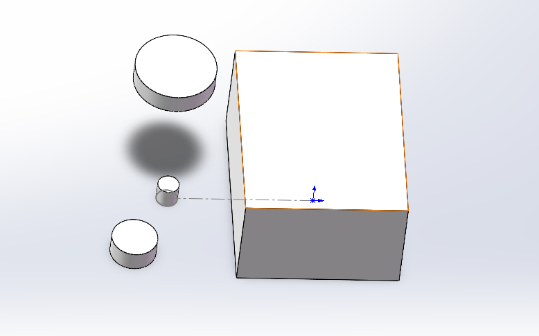

---

## P19 附加课11：放样

### 核心总结

- 放样把两个或多个截面连接成实体，适合截面形状或大小逐渐变化的造型。
- 开始/结束约束控制放样与相邻面的连接方式，常用“与面相切”和“与面的曲率”。
- 引导线控制截面之间的路径和边界趋势，必须与参与放样的各个轮廓相交。
- 多轮廓放样要注意连接点对应关系；3D草图可跨多个平面建立引导线。

### 易错点

- 选择轮廓时点击位置相差过大，连接点错位导致放样扭转；
- 引导线没有依次接触全部截面，无法被放样接受；
- 选择整幅3D草图时没有用选择管理器指定连续线链；
- 需要顺滑过渡时仍使用默认约束，连接处出现明显折痕；
- 简单等截面结构也使用放样，增加不必要的建模复杂度。

### 操作笔记

- 特征-放样凸台/基体-轮廓，按顺序选择两个或多个截面。
- 放样-开始/结束约束-与面相切或与面的曲率，可以控制连接处顺滑过渡。
- 放样-引导线，选择与全部轮廓相交的曲线，可以控制放样路径。
- 草图-3D草图，可以不选择基准面直接连接不同平面上的点。
- 选择管理器-选择组，可以把多段3D草图线作为一条放样引导线。

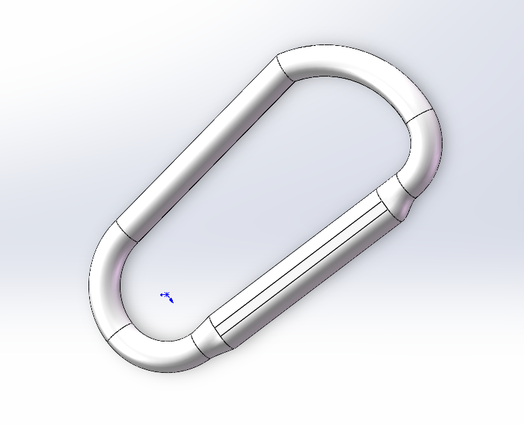
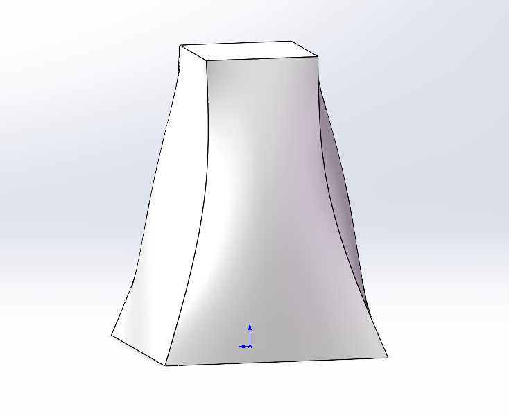

---

## P20 附加课12：钣金

### 核心总结

- 钣金件通常具有一致板厚和折弯圆角，制造过程包括下料、折弯、焊接、打磨和表面处理。
- 基体法兰/薄片建立钣金主体，边线法兰从已有边继续折弯，两者是最常用的钣金命令。
- 钣金特征统一受板厚、折弯半径和K因子控制，K因子会影响展开后的下料长度。
- 钣金模型仍可使用拉伸切除、异型孔向导等普通特征，也可添加焊缝表达工艺。
- 平板型式可以在折弯状态和展开状态之间切换，展开轮廓用于下料。

### 易错点

- 用普通拉伸和圆角堆出钣金外形，导致无法直接展开下料；
- 折弯内半径随意设置得过小，没有考虑板厚、模具和开裂风险；
- 在单个边线法兰中寻找板厚和折弯半径，忽略它们由钣金总参数统一控制；
- 选择错误的法兰位置，造成成品外形尺寸偏移一个板厚；
- 软件能够建模便认为一定能制造，忽略折弯、刀具和焊接空间。

### 操作笔记

- 功能区-右键-钣金/焊件（勾选），可以显示钣金和焊接工具栏。
- 钣金-基体法兰/薄片，选择平面并绘制草图，可以建立第一个钣金特征。
- 钣金参数-板厚4 mm-折弯半径4 mm，可以统一控制本课钣金件。
- 钣金-边线法兰，选择边线并设置长度39.5 mm和法兰位置，可以继续折弯。
- 特征-异型孔向导-国标底部螺纹孔-M3-完全贯穿，可以在钣金面建立螺纹孔。
- 焊件-焊缝，依次选择两条相邻内侧边线，可以添加焊缝显示。
- 设计树-平板型式-解除压缩/压缩，可以在展开和折弯状态之间切换。

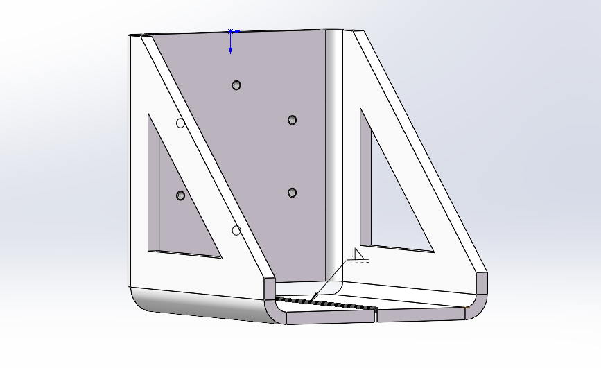

---

# 第三阶段：装配体（P21～P25）

## P21 第十课：装配体1

### 核心总结

- 装配体通过配合关系组合零件或子装配体，设计树主要显示组件及其配合，而不是单个零件的特征顺序。
- 第一个组件应通过“插入零部件”并直接确认放到装配体原点，使两套坐标系重合并自动固定。
- 后续组件可以从文件、已打开文档或其他窗口插入，也可以按住 Ctrl 拖动已有组件快速复制。
- 一个零件通常需要多个配合逐步消除自由度；配合可在组件下或配合文件夹中编辑、删除。

### 易错点

- 随意点击放置第一个组件，造成它的坐标系与装配体坐标系不重合；
- 把装配体设计树当成零件设计树，找不到组件内部特征；
- 只添加一个重合配合，便误以为零件已经完全固定；
- 左键拖动和右键旋转混淆，误判组件是否还可移动；
- 在装配体状态下误删组件，而不是进入零件编辑状态修改特征。

### 操作笔记

- 装配体-插入零部件-选择第一个零件-直接点击确定，可以让零件原点与装配体原点重合并固定。
- Ctrl+Tab可以在已打开的零件和装配体窗口之间切换。
- 窗口-向左/向右平铺，可以同时显示两个文档窗口。
- Ctrl+拖动零件窗口或已有组件，可以向装配体插入或复制组件。
- 鼠标左键拖动组件可以移动，选中后按鼠标右键拖动可以旋转。
- 装配体-配合，依次选择两个面并选择关系，可以建立标准配合。
- 组件-编辑零件/打开零件，可以在装配体内编辑或单独打开源零件。

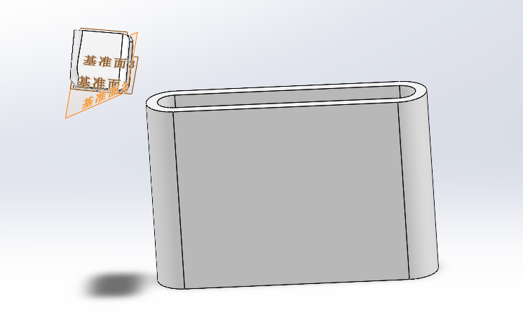

---

## P22 第十一课：装配体2

### 核心总结

- 在装配体中删除特征前必须先进入“编辑零部件”，否则删除的是整个组件。
- 装配体内新建零件可引用其他组件的面、圆心和边线；保存时可选择内部虚拟零件或外部独立文件。
- 标准配合包括重合、平行、垂直、距离、角度、同轴心、相切和锁定，也可以选择基准面、轴、边线等参考。
- 配合过定义时应在设计树检查作用于同一对象的冲突关系，删除或修改重复配合。

### 易错点

- 在装配体状态下右键孔并删除，结果删除整个零件；
- 在装配体内新建零件后没有外部保存，只能随装配体作为虚拟零件使用；
- 删除新零件默认的“在位”配合前，没有理解它用于固定创建位置；
- 对同一对面同时添加重合和垂直等冲突关系；
- 无法选择点或边时没有检查选择过滤器。

### 操作笔记

- 装配体-编辑零部件，进入后可以删除或新增该零件内部的特征。
- 插入零部件下拉菜单-新零件-选择装配面，可以在装配体中建立新零件。
- 保存装配体-外部保存，可以把虚拟零件保存为独立零件文件。
- 组件-配合-在位-删除，可以解除装配体内新建零件的默认固定位置。
- 配合-距离/角度-反转尺寸，可以切换距离或角度的测量方向。
- 组件-右键-固定/浮动，可以直接锁定或释放组件。
- 空白处右键-选择过滤器-清除所有过滤，可以恢复点、边和面的普通选择。

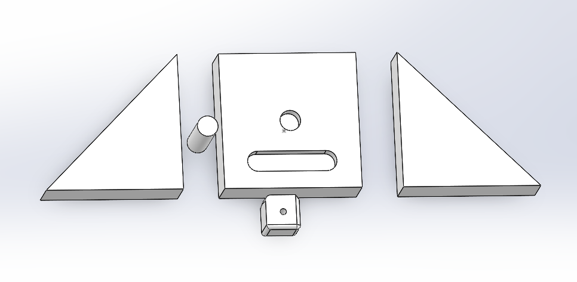

---

## P23 第十二课：装配体3

### 核心总结

- 高级配合中的对称、宽度、限制距离可分别控制对称位置、两组面居中及限定范围内运动。
- 机械配合中的凸轮和槽口可直接表达机构运动，不必用大量普通配合组合。
- 零件可在装配体外建立后插入，仍可在装配体内快速修改特征尺寸。
- 隐藏只关闭显示，透明保留可见和配合，压缩则暂时移除组件及其配合计算。

### 易错点

- 宽度配合的四个面分组选择错误，组件没有位于目标宽度中心；
- 把限制距离当成固定距离，误以为组件不能在上下限之间移动；
- 凸轮配合选择了边线而不是连续凸轮表面；
- 隐藏组件后误以为配合已经删除；
- 为提高可见性本想隐藏，却误点压缩，导致相关配合暂时消失。

### 操作笔记

- 配合-高级-对称，选择对称基准面和两个对象，可以建立对称关系。
- 配合-高级-宽度，选择两组相对面，可以让组件处于目标宽度中心。
- 配合-高级-距离限制，设置最小值和最大值，可以限定组件移动范围。
- 配合-机械-凸轮，选择凸轮连续表面和推杆面，可以建立凸轮运动关系。
- 配合-机械-槽口，选择圆柱面和槽内表面，可以让圆柱沿槽移动。
- 组件-隐藏/更改透明度/压缩，可以分别控制显示、透明观察和计算状态。
- 装配体-显示隐藏零部件，可以在图形区找回隐藏组件。

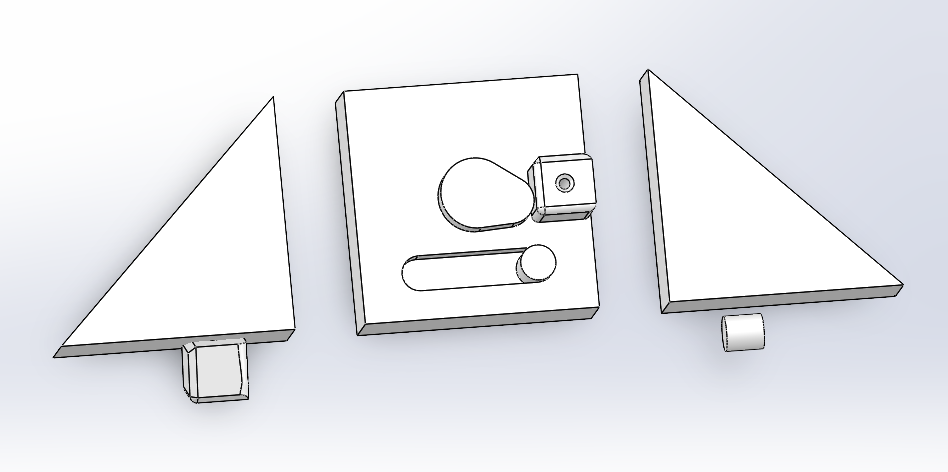

---

## P24 附加课9：装配体加强与问题总结

### 核心总结

- 修改某个零件时应先“编辑零件”，再在该零件中绘制草图和创建特征。
- 装配体特征属于装配体，可同时作用多个组件；单独打开源零件时看不到该特征，一般应谨慎使用。
- 修改配合要先在组件配合表或装配体总配合表中定位关系，再调整配合对象、方向或对齐。
- 装配体报错应先重建，再从设计树最先失败的组件和配合开始检查遗失参考。

### 易错点

- 没有编辑零件就在装配体中画草图，之后发现零件特征无法使用该草图；
- 使用装配体拉伸切除，意外把多个组件同时切穿；
- 以为装配体草图可以直接用于当前编辑零件；
- 组件位置不符合预期时反复拖动，没有查看控制它的配合；
- 看到大量红黄报错便删除组件，没有先处理一个共同遗失的面。

### 操作笔记

- 组件-编辑零件-新建草图-零件特征，可以只修改当前零件。
- 装配体-装配体特征-拉伸切除，会在装配体层级切除符合范围的多个组件。
- 设计树-组件-配合表，或设计树底部-配合总表，可以定位已有配合。
- 配合-编辑特征-配合对齐，可以切换相切、重合等关系的方向。
- Ctrl+B可以重建装配体并刷新全部特征与配合。
- 报错配合-编辑特征-选择遗失参考-重新选择新面，可以修复配合引用。

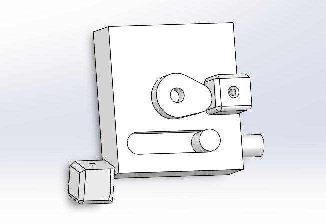

---

## P25 附加课7：装配体阵列、镜像与外观

### 核心总结

- 装配体中复制、阵列和镜像的是组件；编辑组件外形时必须进入零件编辑状态，避免生成装配体特征。
- 线性零部件阵列需要方向、距离、数量和种子组件，可跳过或单独修改阵列实例。
- 镜像零部件除选择镜像面和组件外，还要在后续页面确认镜像后的方向。
- 外观可作用于面、特征、实体、零件或装配体实例；更高层级的外观会覆盖下层外观。

### 易错点

- 未进入零件编辑状态就添加圆角，结果圆角只属于装配体；
- 复制在位零件后误以为副本也被固定，实际 Ctrl 拖出的组件没有配合；
- 只用两个重合配合限制方块，仍保留一个方向的平移自由度；
- 镜像后不进入下一页调整方向，组件姿态错误；
- 在装配体层设置颜色后，误以为源零件文件也永久改变。

### 操作笔记

- 组件-编辑零部件-圆角7 mm，可以把圆角真正写入源零件。
- 装配体-线性零部件阵列，选择种子组件、方向边线、距离和数量，可以复制组件。
- 线性零部件阵列-跳过实例/修改实例，可以取消或单独调整指定阵列组件。
- 装配体-镜像零部件，选择镜像面和组件后进入下一页，可以调整镜像方向。
- 组件-外观-面/特征/实体/零件/装配体，可以在不同层级设置颜色。
- 任务窗格-外观，可以把材质外观拖到模型并选择应用层级。
- 组件-复制外观/粘贴外观，可以在组件之间复用外观。

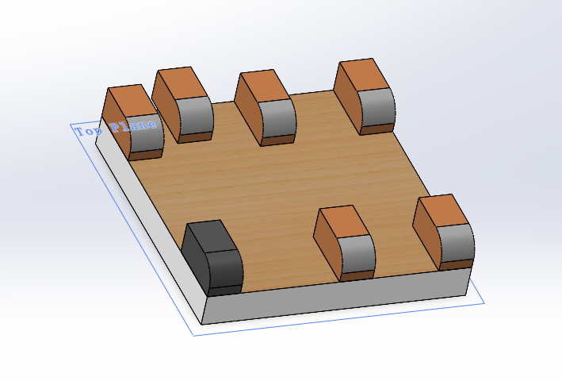

---

# 第四阶段：桌下抽屉实战（P26～P32）

## P26 第十三课：桌下抽屉实战1

### 核心总结

- 产品设计先明确需求、物品尺寸、制造工艺和功能分区，再进入 SOLIDWORKS 建模。
- 本项目用两侧三角滑轨替代完整外框和购买式滚珠轨道，兼顾省料、自定心和FDM免支撑打印。
- 大抽屉分为笔、小物品和较大物品区域，并在内部增加可抽拉的小抽屉利用上层空间。
- 抽屉主截面只画一半，完全定义后沿中心构造线镜像，再向内拉伸形成主体。

### 易错点

- 一开始直接打开软件画外形，没有先确定收纳需求和制造边界；
- 照搬大型滚珠轨道或完整火柴盒外框，成本、体积和材料不适合小型打印件；
- 忽略FDM悬垂和打印尺寸，设计出需要大量支撑或超出平台的零件；
- 只按外观分区，没有考虑笔和小物品是否容易取出；
- 镜像前半截面仍为蓝色，导致整体尺寸和轨道位置不稳定。

### 操作笔记

- 纸上先记录需求、物品尺寸、功能分区和制造方式，可以减少建模阶段反复返工。
- Alt+C可以把中心直线切换为构造线，作为对称镜像轴。
- 草图-镜像实体，选择左半截面和中心构造线，可以得到完整抽屉截面。
- 拉伸凸台/基体-反向-深度200 mm，可以让抽屉从前表面向内成型。

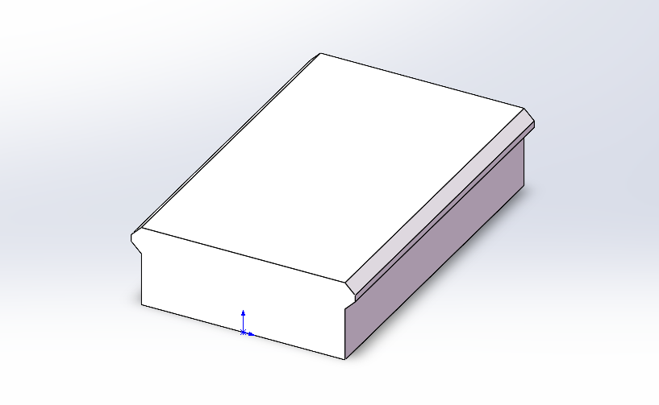

---

## P27 第十四课：桌下抽屉实战2

### 核心总结

- 实战在装配体中采用自顶向下设计：以固定抽屉为基准，新建导轨并引用抽屉轮廓建立联动关系。
- 导轨和抽屉之间要预留打印间隙；导轨采用4 mm薄壁、200 mm长度并保持在位固定。
- 保留固定基准抽屉，复制一个浮动实例用于运动演示；两个重合配合和一个限制距离控制滑动。
- 抽屉通过等距轮廓切空、保留3 mm壁厚，再用4 mm对称薄壁建立中间隔断。
- 修改主抽屉宽度后，引用它的导轨会同步更新，体现装配体关联设计的价值。

### 易错点

- 插入首个抽屉时在图形区随意点击，导致装配体坐标系和零件坐标系不一致；
- 导轨草图与抽屉完全贴合，没有预留FDM打印和滑动间隙；
- 删除导轨的在位配合或让首个抽屉浮动，破坏整个装配体基准；
- 修改零件前忘记进入编辑零件状态；
- 抽屉宽度改变后看到临时报错便撤销，没有先提交草图让关联模型重建。

### 操作笔记

- 插入零部件-选择首个抽屉-直接点击确定，可以让抽屉与装配体坐标系重合并固定。
- 装配体-插入新零件-选择装配体前视基准面，可以在装配体中关联设计导轨。
- 导轨草图-接触面等距0.5 mm，可以给3D打印滑动结构预留间隙。
- 薄壁特征-厚度4 mm-反向-拉伸200 mm，可以生成两侧导轨。
- Ctrl+拖动固定抽屉并隐藏原件，可以得到用于运动演示的浮动抽屉实例。
- 高级配合-距离限制-最小0 mm-最大180 mm，可以限制抽屉开合行程。
- 等距实体-向内3 mm-拉伸切除-离底面3 mm，可以挖空抽屉并保留3 mm壁厚。

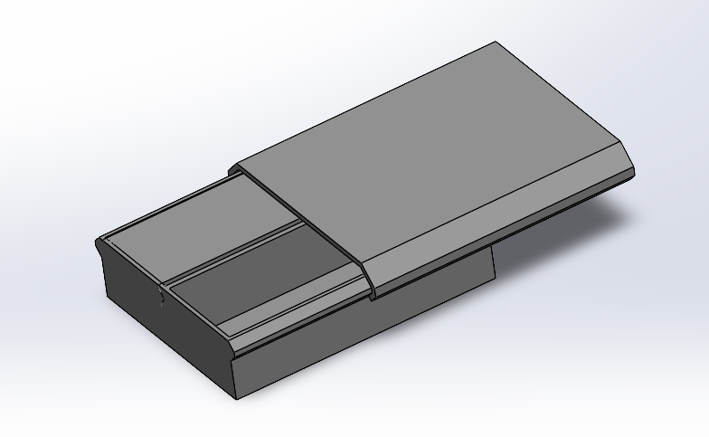

---

## P28 第十五课：桌下抽屉实战3

### 核心总结

- 中间隔板同时承担小抽屉轨道功能，需要用双向薄壁分别控制左右厚度，并为滑动预留1 mm间隙。
- 小抽屉轨道通过在大抽屉上完全贯穿切除形成，再用两个重合和0～180 mm限制距离模拟滑动。
- 软件限位只限制仿真运动，真实产品还必须设计物理挡块，并同时考虑装配进入路径。
- 上游切除方式变化会使下游草图引用的边线消失；修复时删除失效关系并对新边重新添加约束。
- 大抽屉盖和小抽屉推板兼顾内侧限位、把手操作和外观，配合缺口完成装配运动。

### 易错点

- 隔板只按分区壁考虑，没有为小抽屉轨道保留足够强度；
- 只在装配体中设置限制距离，误以为打印件已经具有真实限位；
- 设计外侧挡块后没有检查抽屉能否从轨道装入；
- 把上游切除改成完全贯穿后，忽视导轨挡块草图已丢失参考；
- 用等距实体绘制盖板缺口时漏画顶部闭合线，导致草图开环。

### 操作笔记

- 隔板薄壁特征-双向-左侧5 mm-右侧1 mm，可以兼顾小抽屉轨道和右侧分隔壁。
- 小抽屉轨道草图-滑动面间隙1 mm-底部间距2 mm-完全贯穿切除，可以建立轨道槽。
- Tab可以快速隐藏鼠标所在组件。
- Ctrl多选两个配合面-快捷菜单-重合，可以快速建立装配配合。
- 高级配合-距离限制-最小0 mm-最大180 mm，可以限制小抽屉行程。
- 上游修改导致草图报错时，删除棕色失效关系并重新添加平行和距离，可以恢复引用。
- 抽屉盖草图-下部间距7 mm-拉伸5 mm，可以形成盖板和手指开启位。
- 小抽屉顶面-向内等距2 mm-切除至距底面2 mm，可以挖出文具槽。

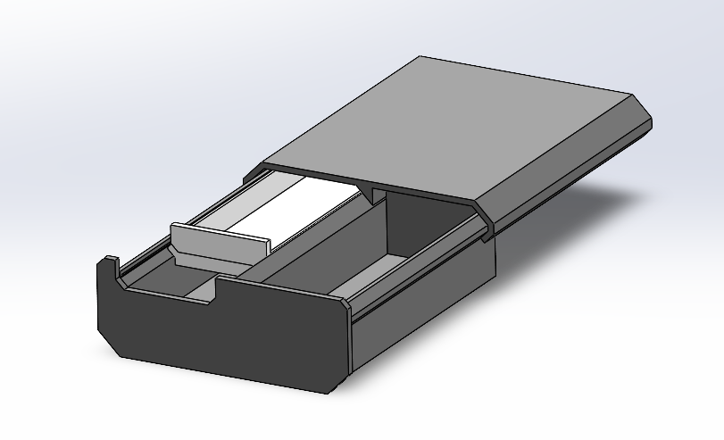

---

## P29 第十六课：桌下抽屉实战4

### 核心总结

- 设计连接方式前要先推演安装顺序；抽屉必须从导轨后方装入，因此前盖不能与抽屉一体打印。
- 前盖与抽屉采用双燕尾榫连接，避免胶水和额外螺钉，同时需要间隙和安装到位后的止挡。
- “移动面”可以直接加厚、延长或移动局部表面，适合设计后期快速调整现有模型。
- 导轨延长到245 mm可增加抽屉完全拉出时的接触长度，提高滑动稳定性，同时不超出常见255 mm打印平台。
- 复杂装配体中可用“孤立”只显示目标组件，减少其他零件和边线对编辑的干扰。

### 易错点

- 只考虑前盖与抽屉一起运动，忽略一体化后抽屉无法装入导轨；
- 燕尾榫和燕尾槽尺寸完全相同，没有预留打印装配间隙；
- 编辑透明组件时选择穿透或线架显示异常，误选其他零件；
- 上游切除使止挡草图引用边线变化后，没有重新标注失效尺寸；
- 只追求最大导轨长度，忽略打印机平台尺寸和收纳深度是否便于取物。

### 操作笔记

- 插入-面-移动-等距-选择两面-2 mm，可以把抽屉连接区从3 mm加厚到5 mm。
- 燕尾榫草图-高3 mm-角度60°-宽30 mm-定位40 mm，可以建立单侧榫头并镜像。
- 拉伸凸台/基体-起始条件-曲面/面/基准面-选择抽屉底面-深度25 mm，可以控制燕尾榫起点。
- 燕尾槽草图-斜面间隙0.1 mm-顶部间隙0.5 mm-完全贯穿切除，可以预留装配余量。
- 编辑透明零件前先恢复不透明，可以减少显示和选择异常。
- 拉伸切除-成形到顶点，可以精确切到燕尾止挡凸台的端点。
- 插入-面-移动-45 mm，可以把200 mm导轨延长到245 mm。
- 组件-右键-孤立，可以临时只显示目标组件。

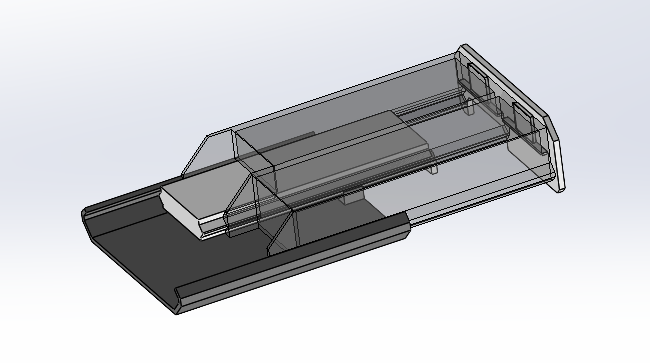

---
